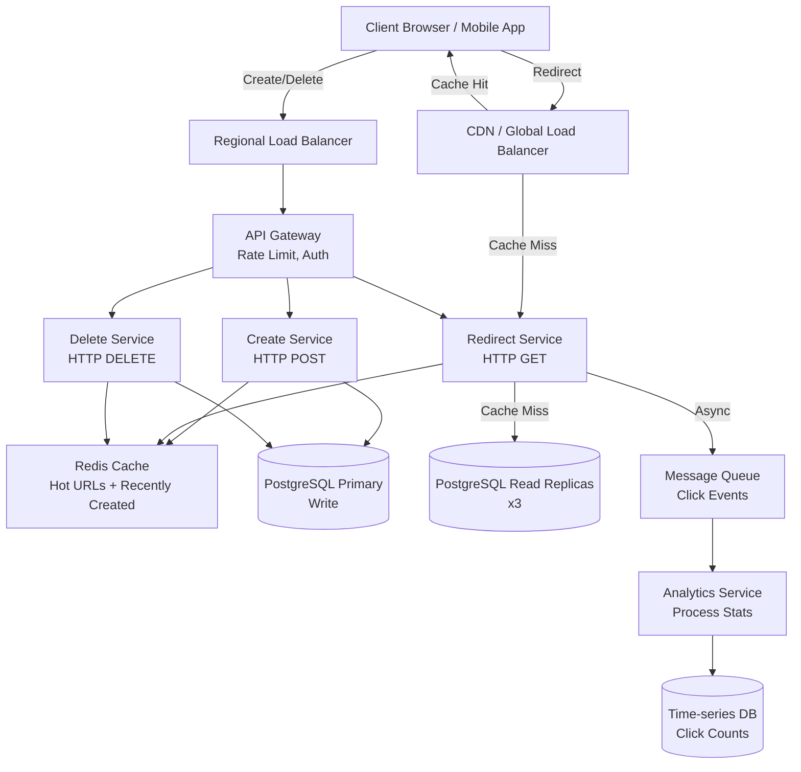
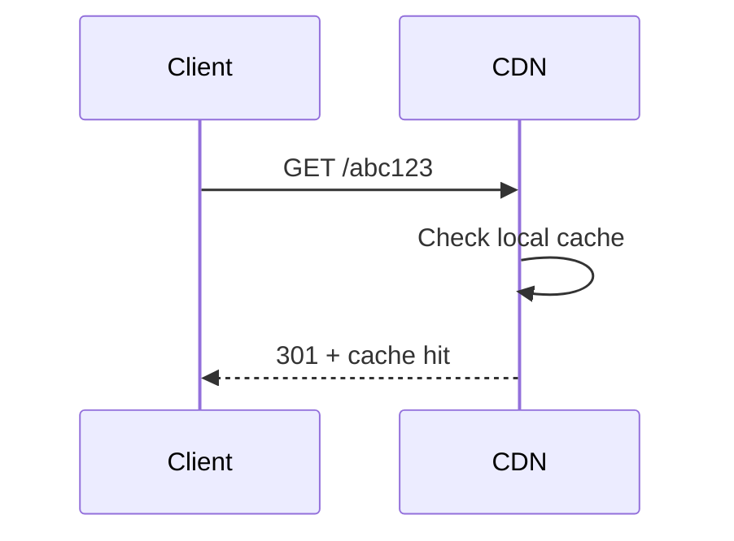
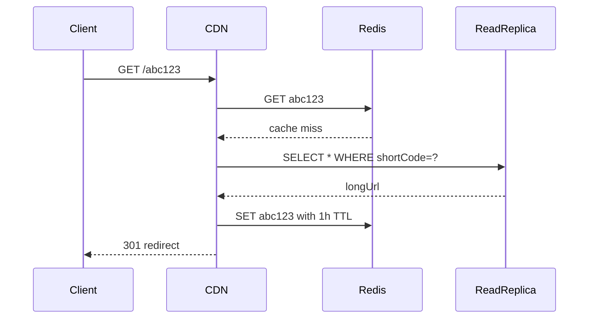

# [Case Study Title]

*Template for designing a system design case study. Replace all bracketed sections with your content.*

## Problem Statement

[1–2 paragraphs. What are we building and for whom? What's the user-facing problem we're solving?]

*Example: "Design a URL shortening service like bit.ly or TinyURL. Users submit long URLs and receive short aliases that redirect to the original URL. Millions of users create and follow shortened links daily. The system must be highly available and respond to redirects sub-100ms at global scale."*

---

## Clarifying Questions & Requirements

Clarify with the interviewer before diving into design.

### Functional Requirements

- [List 3–5 core features the system must support]
- Example:
  - Create short URL from long URL
  - Redirect from short URL to long URL
  - Delete a shortened URL
  - Get statistics (click count, geographic distribution)
  - Custom aliases (e.g., bit.ly/mycompany)

### Non-Functional Requirements

- **Scale**: [DAU/MAU, QPS, data size] — *Example: 100 million DAU, 100k QPS peak, 1 billion URLs stored*
- **Latency**: [Target response time] — *Example: P99 latency < 100ms*
- **Availability**: [SLA target] — *Example: 99.95% uptime*
- **Consistency**: [Strong, eventual, read-after-write?] — *Example: Eventual consistency OK for analytics, but URL redirects must be immediately consistent*
- **Geographic scope**: [Single region or multi-region?] — *Example: Global, with regional caches*

---

## Scale Estimation (Back-of-Envelope)

[Use the fundamentals from [Capacity Planning & Estimation](../fundamentals/capacity-planning-and-estimation/) to estimate.]

### Assumptions

- 100M DAU
- Each user creates ~1 short URL per week
- Each short URL is followed ~10 times on average
- 10% of traffic is creates, 90% is redirects (reads)

### Calculations

| Metric | Calculation | Result |
|---|---|---|
| **Creates per second** | 100M DAU × (1 create/week) / (7 × 86400s) | ~165 QPS |
| **Redirects per second** | 165 QPS × 10 follows/URL | ~1650 QPS |
| **Peak QPS** | 1650 × 5 (peak multiplier) | ~8250 QPS |
| **Storage (1 year)** | 100M creates × 0.5 KB per URL record | ~50 GB |
| **Storage (5 years)** | 50 GB × 5 | ~250 GB |
| **Bandwidth (create)** | 165 QPS × 500 bytes | ~82 KB/s |
| **Bandwidth (redirect)** | 1650 QPS × 1000 bytes | ~1.6 MB/s |

**Key insight**: This is a **read-heavy system** (90% reads), so we optimize for read throughput with caching and read replicas.

---

## API Design

Define the key endpoints and their contracts.

```
POST /api/shorten
Request: { longUrl: string, customAlias?: string, expiryDays?: int }
Response: { shortCode: string, shortUrl: string, createdAt: int64 }
Errors: 400 (invalid URL), 409 (alias already taken), 503 (service unavailable)
Idempotent: No (multiple calls create multiple short codes)

GET /{shortCode}
Request: (path parameter)
Response: HTTP 301 redirect to longUrl
Errors: 404 (short code not found), 410 (expired), 503 (service unavailable)
Idempotent: Yes (same shortCode always redirects to same URL)

DELETE /api/{shortCode}
Request: (path parameter, requires auth)
Response: { success: bool }
Errors: 404 (not found), 403 (unauthorized), 503
Idempotent: Yes

GET /api/{shortCode}/stats
Request: (path parameter)
Response: { shortCode, longUrl, createdAt, clicks: int, topCountries: [{country, count}] }
Errors: 404, 403, 503
Idempotent: Yes (reads only)
```

---

## Data Model

[Describe entities, schema, and storage technology choice. Reference [Databases](../fundamentals/databases/) fundamentals.]

### Entities

```
ShortCode: {
  id (PK): 64-bit integer (or base62 string)
  shortCode (Unique): base62 string (6–8 chars)
  longUrl: string (2000 chars max)
  userId (FK): int64
  createdAt: int64 (unix timestamp)
  expiresAt: int64 (nullable)
  clicks: int64 (approximate, for denormalization)
  isDeleted: bool (soft delete)
}

ClickEvent: {
  id (PK): 64-bit integer
  shortCodeId (FK): int64
  country: string
  timestamp: int64
  referer: string (nullable)
  userAgent: string (nullable)
}

User: {
  id (PK): int64
  email: string (unique)
  username: string (unique)
  createdAt: int64
}
```

### Storage Choice

**Primary Database**: PostgreSQL (or MySQL)
- Relational model, strong ACID guarantees for creating/deleting URLs
- Sharded by user ID for horizontal scaling

**Cache Layer**: Redis
- Cache hot short codes (top 1% of URLs, likely to be 90% of traffic)
- Cache recently created URLs (1-hour TTL)
- Cache miss → query database → populate cache

**Analytics**: Time-series DB (InfluxDB, Prometheus) or data warehouse (Snowflake)
- Ingest click events for stats computation
- Separate from main transactional DB to avoid impacting redirects

### Indexing

- `ShortCode` table: Primary key on `shortCode`, secondary index on `userId + createdAt` (for listing user's URLs)
- `ClickEvent` table: Partition by time (daily), index on `shortCodeId + timestamp` (for stats queries)

---

## High-Level Design

[Draw or describe the system architecture. Use Mermaid for diagrams.]



### Component Responsibilities

- **Global Load Balancer**: Routes traffic to regional clusters.
- **API Gateway**: Rate limiting (token bucket), authentication, request logging.
- **Create Service**: Generates short codes, writes to DB, populates cache.
- **Redirect Service**: Looks up short code in cache/DB, returns 301 redirect.
- **Delete Service**: Soft-delete from DB, invalidate cache.
- **Redis Cache**: 1-hour TTL on recently created, LRU eviction on hot URLs.
- **PostgreSQL**: Sharded by user ID for scale, read replicas for read throughput.
- **Message Queue**: Async click events to avoid blocking redirects.
- **Analytics Service**: Aggregates click counts, geographic distribution.

---

## Deep Dive

### 1. Short Code Generation

**Challenge**: Generate unique, short, URL-safe codes efficiently.

**Approach 1: Auto-increment + Base62 encoding**
- Database auto-increment ID → base62 encode → short code
- Pros: Guaranteed unique, simple, fast
- Cons: Sequential IDs leak information (how many URLs created), limited to one writer per table
- Mitigation: Use machine ID + timestamp + counter for distributed generation

**Approach 2: Random generation with retry**
- Generate 6–8 random base62 characters, check if exists, retry on collision
- Pros: Non-sequential, can generate in any service
- Cons: Collision probability grows with scale, requires retry logic
- At 1B URLs with 6-char codes (62^6 = 56B possibilities), collision rate ≈ 0.002%

**Chosen**: Auto-increment + Base62, sharded by user ID to avoid single-writer bottleneck.

**Sequence diagram**:
```mermaid
sequenceDiagram
    Client ->> API Gateway: POST /api/shorten
    API Gateway ->> Create Service: Request (with user auth)
    Create Service ->> PrimaryDB: INSERT into ShortCode table
    PrimaryDB -->> Create Service: autoIncrement ID
    Create Service ->> Create Service: base62_encode(ID)
    Create Service ->> Cache: SET shortCode with 1h TTL
    Create Service -->> API Gateway: { shortCode, shortUrl }
    API Gateway -->> Client: 200 OK
```

### 2. Redirect Serving (Critical Path)

**Challenge**: Serve billions of redirects sub-100ms globally.

**Approach**: Multi-layer caching + read replicas
1. CDN (for geography): Cache redirects at edge servers globally, serve 301 locally
2. Local Redis: Cache hot URLs (top 1% of traffic = 90% of requests)
3. Read Replica: Cache miss → query replica (no load on primary)
4. Cold storage: Very old URLs served from archive DB (rare)

**Cache invalidation**: TTL-based. 1-hour TTL for recently created URLs, 24h for older URLs. On delete, actively invalidate.

**Handling thundering herd**: If a viral URL's cache expires during peak traffic, 1000 requests might simultaneously query the DB. Mitigate with:
- Probabilistic early expiration (refresh cache at 80% of TTL)
- Lock-based cache-aside (only one request goes to DB, others wait)

**Sequence diagram (cache hit)**:


**Sequence diagram (cache miss, DB hit)**:


### 3. Sharding Strategy

**Challenge**: Single PostgreSQL instance can't handle 1.6 MB/s write traffic at peak.

**Strategy**: Shard by user ID (hash-based)
- User ID → shard number (hash(userID) % numShards)
- Each shard: Primary + 2 replicas
- Benefits: Balanced load, local user data, consistent hashing on resharding

**Hot spots**: Viral URLs created by celebrity users → concentrate on one shard. Mitigation:
- Cache aggressively (celebrity URLs are read-heavy, so cache handles 90%+ of traffic)
- If a user creates 10x more URLs than average, shard their data separately (micro-sharding)

**Resharding**: Adding a new shard requires re-hashing all user data. Done asynchronously:
1. Double-write: New writes go to old + new shard
2. Backfill: Scan old shard, copy to new shard
3. Verify: Check both match
4. Cutover: Redirect reads to new shard
5. Cleanup: Drop old shard

---

## Bottlenecks & Scaling

### At 10x (82.5k QPS peak)

**Bottleneck**: Single cache instance can't handle 82.5k QPS.

**Solution**: Redis cluster with consistent hashing. Each short code hashes to a specific Redis node. 3-node cluster handles load, replication handles failover.

### At 100x (825k QPS peak)

**Bottleneck**: Read replicas are slow at 825k QPS. Network bandwidth becomes limiting.

**Solution**: Add more read replicas and partition short codes temporally. Recent URLs (created in last 7 days) on replica 1, older on replica 2. Route reads to the appropriate replica.

### At 1000x (8.25M QPS peak)

**Bottleneck**: PostgreSQL no longer viable. Need sharded NoSQL.

**Solution**: Replace PostgreSQL with sharded Cassandra or DynamoDB. Trade strong consistency for eventual consistency + availability. Read model (for stats) served from a separate analytics data warehouse.

---

## Trade-offs & Alternatives

| Choice | Alternative | Why We Chose This |
|---|---|---|
| PostgreSQL | NoSQL (DynamoDB, Cassandra) | PostgreSQL handles our scale with sharding, provides ACID guarantees for deletes, and has strong operational tooling. We can switch to NoSQL later if scale demands it. |
| Hash-based sharding | Range-based sharding | Hash is simpler to rebalance and avoids hot spots. Range sharding would group sequential user IDs together, causing uneven load. |
| Redis | In-process cache (memcached) | Redis supports expiration, replication, and Lua scripting for atomic operations. Memcached is simpler but less flexible. |
| Async click events | Sync analytics | Async prevents click events from blocking redirects. Eventual consistency is acceptable for analytics. |
| Soft deletes | Hard deletes | Soft deletes let us audit who deleted what URL and when. Hard deletes would be instant but lose history. |
| CDN for redirects | Direct-to-origin | CDN caches at edge, serving 301s locally. Direct-to-origin has high latency from regions far from the data center. |

---

## Failure Scenarios & Mitigations

### Primary Database Failure

**Scenario**: PostgreSQL primary goes down. Write traffic halts.

**Mitigation**:
- Continuous replication to a standby replica in the same region
- Automated failover: Detects primary is down after 3 failed health checks, promotes a replica to primary (< 5 sec)
- Manual operator can force a failover if automated detection fails
- Multi-region setup: Async replication to another region's read replica, can be manually promoted if local region is down

**RTO** (Recovery Time Objective): < 5 sec  
**RPO** (Recovery Point Objective): < 5 sec (lose ~5 sec of writes)

### Redis Failure

**Scenario**: Redis instance goes down. Cache is lost, suddenly DB is hit with 100x traffic.

**Mitigation**:
- Redis cluster with 3 nodes, quorum-based replication
- On any node failure, failover is automatic, clients reconnect
- DB is sized to handle 10% of requests without cache (degradation, but not catastrophe)
- Rate limiting protects DB from being overwhelmed by cache-miss traffic spikes

**RTO**: < 1 sec  
**RPO**: minimal (in-memory data, acceptable to lose)

### Read Replica Lag

**Scenario**: Data written to primary, not yet on read replicas. Rare user sees their own URL as "not found."

**Mitigation**:
- For reads immediately after writes (user deletes URL), query the primary
- Caching hides the issue in most cases (delete immediately invalidates cache)
- Async replication lag < 100ms typically, users tolerate eventual consistency

### Regional Outage

**Scenario**: Entire AWS region fails (earthquake, power outage).

**Mitigation**:
- Multi-region replication: Data replicated to 2+ regions asynchronously
- On region failure, traffic routed to healthy region via GeoDNS
- Trade-off: Higher latency from far regions, eventual consistency on reads, higher infra cost

**RTO**: ~30 sec (DNS propagation)  
**RPO**: ~1 sec (async replication lag)

---

## Interviewer Follow-up / Twist Questions

### Q1: "What if we need to support custom aliases, and a user wants a popular word like 'google'?"

**Hint**: This is a reservation/booking problem. How do you prevent conflicts?

**Approach**:
- Check availability before allowing reservation
- Reservation table: (customAlias, userId, expiresAt)
- TTL-based reservation: User books 'google' for 30 days, must use it within that time or it expires
- If user never uses it, it reverts to available for someone else

### Q2: "What if URLs must be deleted across all regions within 10 seconds?"

**Hint**: Strong consistency in a distributed system is expensive.

**Approach**:
- Use a distributed transaction (Saga or 2PC) across regions
- Or: Primary region writes, secondary regions subscribe to delete log and apply changes
- Trade-off: Latency vs consistency. If 10sec is hard requirement, you need synchronous replication and accept higher latency.

### Q3: "How would you handle spam (e.g., someone creating millions of short URLs to launch a DDoS)?

**Hint**: Rate limiting at multiple layers.

**Approach**:
- Per-user rate limit: 100 URLs/hour (in gateway or user service)
- Per-IP rate limit: 10k URLs/hour (in load balancer)
- Captcha after N failed attempts
- Manual review for bulk creation patterns

### Q4: "How would you implement analytics (top URLs, geographic distribution) without impacting the main redirect path?"

**Hint**: Async processing and separate read model.

**Approach**:
- On redirect, emit click event to queue (< 1ms added latency, non-blocking)
- Background analytics service consumes events, aggregates into HyperLogLog for cardinality, time-series DB for trends
- Serve stats queries from analytics DB, not primary (completely separate read model)

### Q5: "What if we need to ensure a user can always find their own URL, even if there's replication lag?"

**Hint**: Read-after-write consistency.

**Approach**:
- On create, return immediately with the short code (it's already in the primary)
- On read-list (user views their URLs), route to primary for fresh data
- Accept stale data for other users, but strong consistency for the authenticated user

---

## Key Takeaways

- **Scale-first thinking**: Design for billions of reads with millisecond latency and replication.
- **Read-heavy optimization**: Multi-layer caching (CDN, Redis, DB replicas) handles 90% of traffic at the edge.
- **Sharding strategy**: Hash-based user sharding scales horizontally without data skew.
- **Async processing**: Click events don't block redirects; they're processed asynchronously for analytics.
- **Failure preparedness**: Multi-region, automated failover, degradation modes (serve stale cache on DB failure).
- **Simplicity first**: Start simple (single DB, cache, CDN), add sharding only when needed.

---

## Related Fundamentals

- [Capacity Planning & Estimation](../fundamentals/capacity-planning-and-estimation/) – Back-of-envelope math, latency numbers
- [Databases](../fundamentals/databases/) – Sharding, replication, indexing strategies
- [Caching](../fundamentals/caching/) – Cache-aside, invalidation, TTL
- [Distributed Data Structures](../fundamentals/distributed-data-structures/) – Consistent hashing, Bloom filters
- [Scalability & Load Balancing](../fundamentals/scalability-and-load-balancing/) – Load balancing algorithms, horizontal scaling
- [Reliability & Resiliency](../fundamentals/reliability-and-resiliency/) – Failover, multi-region DR

---

**Status**: ✅ Complete template. Use this structure for all case studies.
