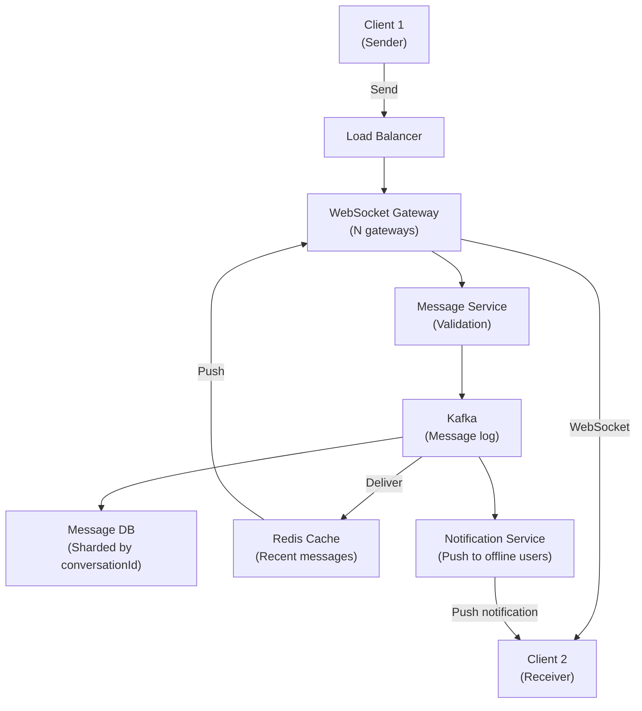

# Chat & Messaging System

*Design a real-time chat system like WhatsApp, Slack, or Facebook Messenger. Billions of messages, low latency delivery, message ordering, group chats.*

## Problem Statement

Build a chat service for 500M users. 100M DAU sending 100B messages/day. Message delivery must be < 100ms (user perceives as instant). Messages must arrive in order. Think WhatsApp or Slack: high reliability, strong ordering, real-time.

---

## Clarifying Questions & Requirements

### Functional Requirements
- Send/receive messages (1-to-1 and group)
- Message persistence (history available)
- Typing indicators
- Read receipts
- Online/offline status
- Message ordering (FIFO per conversation)

### Non-Functional Requirements
- **Scale**: 500M users, 100M DAU, 1.1M messages/sec
- **Latency**: P99 < 100ms end-to-end
- **Ordering**: Messages in exact FIFO order
- **Reliability**: No message loss
- **Consistency**: Eventual consistency acceptable

---

## Scale Estimation

| Metric | Calculation | Result |
|---|---|---|
| **Messages/day** | 100B | 1,155,556 QPS |
| **Concurrent connections** | 100M users × 10% active | 10M WebSocket connections |
| **Storage (1 year)** | 100B msgs/day × 1KB × 365 | 36.5 PB (but archive old) |
| **Bandwidth** | 1.1M QPS × 1KB | 1.1 GB/s |

**Key insight**: Real-time requires WebSockets/long-polling. High throughput needs Kafka. Ordering needs per-conversation sequencing.

---

## High-Level Architecture



---

## Deep Dive: Message Delivery

### Challenge: Ordering

Messages must arrive in sender order to receiver:

```
Sender sends: M1, M2, M3 (in order)
Receiver must see: M1, then M2, then M3 (never M3, M1, M2)

With distributed servers, hard to guarantee order without coordination.
```

### Solution: Kafka Per Conversation

```
Each conversation = Kafka topic with 1 partition (single shard)
  Why 1 partition? Partitions are ordered separately
  Multiple partitions = can't guarantee global order

Message flow:
  Sender: Publish message to Kafka topic "conversation:123"
  Kafka: Assigns sequence number (offset)
  Receiver: Consumes from offset, sees ordered messages
  
Result: Perfect FIFO ordering, no coordination needed
```

### Delivery Path (Sender → Receiver in Real-Time)

```
1. Client1 sends message via WebSocket
2. Gateway receives → Message Service validates
3. Message Service publishes to Kafka topic "conversation:123"
4. Kafka persists (1 copy on broker, 2 replicas)
5. Kafka notifies subscribers (push model)
6. Notification handler:
   - If receiver online: Send via WebSocket gateway (< 100ms)
   - If receiver offline: Queue for push notification
7. Client2 receives via WebSocket or push notification
```

---

## Handling Offline Users

User closes app or goes offline:

```
Scenario:
  Client receives message while offline
  Client goes online
  Message should be delivered

Solution:
  Messages stored in DB (durable)
  When client connects: Query DB for missed messages since last seen
  Deliver all missed messages (ordered by offset)
  
Indexing: DB indexed on (conversationId, userId, lastSeenOffset)
  Fast query: Get all messages for user after offset X
```

---

## Group Chats

Multiple users in one conversation:

```
Conversation: "team-meeting" with users {Alice, Bob, Carol}

Message published to Kafka topic "conversation:group-123"
  Kafka: Persists with offset = 5

All three users subscribe to same topic (implicit)
  Alice: Sees message at offset 5
  Bob: Sees message at offset 5
  Carol: Sees message at offset 5

All see same ordering because single Kafka partition.
```

---

## Typing Indicators

Non-persistent ephemeral message (doesn't need Kafka):

```
Client: Publish typing_indicator to WebSocket gateway
  {"conversationId": 123, "userId": 1, "isTyping": true}

Gateway broadcasts to all connected users in conversation 123
  (only active connections, not persistent)

Client stops typing: Send isTyping=false, unsubscribe
```

---

## Bottlenecks & Scaling

### Current Bottleneck

**WebSocket Gateway**: 10M connections × 10KB buffer per connection = 100GB memory needed.

**Solution**: Distribute across 100 gateway servers, each handles 100k connections.

### At 10x Scale

**Bottleneck**: Kafka throughput (11M msgs/sec).

**Solution**: Increase Kafka brokers, use multiple Kafka clusters by geography.

### At 100x

**Bottleneck**: Database I/O (persisting to disk).

**Solution**: Archive to cold storage, keep recent 6 months hot.

---

## Failure Scenarios

### Message Service Crash

Messages being sent queue in Kafka, eventually delivered (durable queue).

**RTO**: ~30 seconds (client retry)  
**RPO**: 0 (Kafka has replicas)

### Network Partition

Sender and receiver in different regions, network down:

**Mitigation**:
- Geo-replicated Kafka (cross-region)
- Messages buffer locally, sync when reconnected

---

## Trade-offs

| Choice | Alternative | Rationale |
|---|---|---|
| **One Kafka partition per conversation** | Multiple partitions + merging | Simplicity, guaranteed ordering, no merge needed |
| **WebSockets** | Long-polling | Lower latency, less bandwidth for real-time |
| **Eventual consistency** | Strong consistency | Ordering is strong, but reads eventual (acceptable) |
| **Push notifications** | Pull model for offline | Users expect to be notified when message arrives |

---

## Related Fundamentals

- [Networking/WebSockets](../fundamentals/networking-and-protocols/websockets-and-realtime-transport.md) – Real-time transport
- [Messaging](../fundamentals/messaging-and-streaming/) – Kafka ordering, delivery guarantees
- [Databases](../fundamentals/databases/) – Sharding by conversationId

---

**Status**: ✅ Complete. Shows real-time system with ordering constraints.
