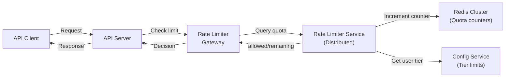

# Distributed Rate Limiter

*Design a rate limiter that works across multiple servers, used to protect APIs from abuse and ensure fair resource allocation.*

## Problem Statement

Design a distributed rate limiter service. Multiple API servers need to enforce rate limits (e.g., 100 requests per user per minute) consistently across the cluster. The rate limiter must track quotas in near-real-time and reject requests that exceed limits with minimal latency overhead.

---

## Clarifying Questions & Requirements

### Functional Requirements

- Rate limit by user ID, IP, or API key
- Support multiple limit types: per-minute, per-hour, per-day
- Allow burst traffic (token bucket model)
- Graceful degradation if rate limiter is unavailable
- Support different tiers (free: 100 req/min, premium: 10k req/min)

### Non-Functional Requirements

- **Latency**: < 10ms to check rate limit (overhead per request)
- **Accuracy**: ~99% (approximate counting acceptable)
- **Consistency**: Soft guarantees (occasional over-limit requests tolerable)
- **Scale**: 1M+ unique users/keys, 100k+ requests/sec peak
- **Availability**: 99.9% (graceful degradation if rate limiter fails)

---

## Scale Estimation

| Metric | Estimate |
|---|---|
| Active users | 1M |
| Peak requests/sec | 100k |
| Rate limit checks/sec | 100k |
| Storage (user quotas) | 1M users × 100 bytes = 100 GB |
| Average quota per user | ~10 different time windows (minute, hour, day) |

---

## API Design

```
POST /rate-limit/check
Request: { 
  userId: string,
  apiKey?: string,
  action: string,
  tokens: int (default 1)
}
Response: { 
  allowed: bool,
  remaining: int,
  resetAt: timestamp,
  retryAfter?: int (seconds)
}
Error: 503 (rate limiter unavailable)
Latency: p99 < 10ms

GET /rate-limit/quota/{userId}
Response: { 
  limits: [
    { window: "1m", limit: 100, used: 50, remaining: 50, resetAt },
    { window: "1h", limit: 5000, used: 2000, remaining: 3000, resetAt },
    { window: "1d", limit: 100000, used: 50000, remaining: 50000, resetAt }
  ]
}
```

---

## High-Level Design



---

## Deep Dive: Token Bucket Algorithm

**Challenge**: Allow bursts (user can send 3 requests at once up to limit), but enforce average rate.

**Solution**: Token Bucket

```
Bucket capacity: 100 tokens
Refill rate: 100 tokens/minute (1.67 tokens/sec)

Request comes in, wants 1 token:
  Current tokens: 50
  Tokens available: Yes
  Remove 1 token: tokens = 49
  Allow request

Request comes in 0.6 sec later, wants 1 token:
  Elapsed time since last check: 0.6 sec
  Tokens earned: 0.6 sec × 1.67 tokens/sec = 1 token
  Current tokens: min(49 + 1, 100) = 50  [cap at capacity]
  Tokens available: Yes
  Remove 1 token: tokens = 49
  Allow request

After 100 seconds:
  Tokens earned: 100 sec × 1.67 tokens/sec = 167 tokens
  Current tokens: min(0 + 167, 100) = 100 (full bucket)
  Bucket full, ready for burst
```

**Algorithm pseudocode**:

```
def check_rate_limit(user_id, tokens_requested=1):
    bucket = redis.get(f"rate_limit:{user_id}:bucket")
    
    if bucket is None:
        # First request, create bucket
        bucket = {
            tokens: CAPACITY,
            last_refill: now()
        }
    else:
        # Refill based on elapsed time
        elapsed_sec = (now() - bucket.last_refill).total_seconds()
        tokens_earned = elapsed_sec * REFILL_RATE
        bucket.tokens = min(bucket.tokens + tokens_earned, CAPACITY)
        bucket.last_refill = now()
    
    if bucket.tokens >= tokens_requested:
        bucket.tokens -= tokens_requested
        redis.set(f"rate_limit:{user_id}:bucket", bucket)
        return { allowed: true, remaining: bucket.tokens }
    else:
        return { 
            allowed: false, 
            remaining: bucket.tokens,
            retry_after: ceil((tokens_requested - bucket.tokens) / REFILL_RATE)
        }
```

**Pros**:
- Allows bursts (up to capacity)
- Fair (everyone gets refill_rate tokens/sec)
- Simple to implement

**Cons**:
- Floating-point precision issues (elapsed_sec might be fractional)
- Requires accurate clock (distributed systems challenge)

---

## Distributed Consistency Challenge

**Problem**: Multiple API servers query rate limiter simultaneously for same user. Must maintain consistency.

**Scenario**:

```
User quota: 5 requests/minute

t=0.00s: Server A queries limiter: tokens=5, uses 1, leaves 4
t=0.01s: Server B queries limiter: reads stale tokens=5, uses 1, leaves 4 (wrong! should be 3)
t=0.02s: Server C queries limiter: reads stale tokens=5, uses 1, leaves 4 (wrong! should be 2)

Result: User made 3 requests in parallel, but counter only decremented by 1.
User can burst 5 requests in parallel, violating the 5/min limit.
```

**Mitigation**: Use Redis atomic operations

```
SCRIPT: Increment counter atomically

redis_script = """
local tokens = redis.call('GET', KEYS[1])
if tokens == false then
    tokens = CAPACITY
end

tokens_earned = (now - redis.call('GET', KEYS[2])) * REFILL_RATE
tokens = min(tokens + tokens_earned, CAPACITY)
redis.call('SET', KEYS[2], now)

if tokens >= ARGV[1] then
    redis.call('SET', KEYS[1], tokens - ARGV[1])
    return { allowed: true, remaining: tokens - ARGV[1] }
else
    return { allowed: false, remaining: tokens }
end
"""

# Atomic check-and-decrement (one Lua script call to Redis)
result = redis.eval(redis_script, keys=[user_id:tokens, user_id:last_refill], 
                      args=[tokens_requested])
```

**Why Lua**: Single atomic operation prevents race conditions. No intermediate states.

---

## Handling Clock Skew

**Problem**: Distributed systems don't have perfectly synchronized clocks. If server A has clock 10 sec ahead of server B, bucket refill will be inconsistent.

**Mitigation**:

```
Use Redis server clock as source of truth:

def check_rate_limit(user_id):
    # Use Redis's TIME command for consistent clock
    redis_time = redis.TIME()  # (seconds, microseconds) from Redis server
    
    bucket = redis.get(f"rate_limit:{user_id}")
    elapsed = redis_time - bucket.last_refill
    tokens_earned = elapsed * REFILL_RATE
    bucket.tokens = min(bucket.tokens + tokens_earned, CAPACITY)
    ...
```

**Trade-off**: Extra Redis call (TIME), but ensures consistency. Can be batched with quota check.

---

## Failure Scenarios

### Rate Limiter Unavailable

**Scenario**: Redis cluster goes down. Rate limiter can't check quotas.

**Mitigation**: Open circuit, allow requests (better to serve slow than fail).

```
Monitoring:
  if rate_limiter.latency > 100ms:
    circuit_breaker.trip()
    allow all requests (fail open)
  
When recovered:
  circuit_breaker.reset()
    resume rate limiting
```

**Trade-off**: Temporary abuse possible, but service stays up.

### Distributed System: Exactly-Once Counting

**Challenge**: Distributed systems can lose or duplicate messages. How do we count accurately?

**Problem**: User makes request, server increments counter, network loss → increment not persisted. User's quota incorrectly high.

**Solution**: Idempotent counter operations.

```
Every rate limit check has a unique ID (e.g., request_id + timestamp)

On Redis:
  IF request_id not seen before:
    Increment counter (first time)
  ELSE:
    Skip increment (replay, idempotent)
    
This requires storing seen request_ids (extra storage).
```

**Alternative**: Use eventual consistency. TTL-based reset ensures accuracy over time.

---

## Related Fundamentals

- [Rate Limiting & Traffic Management](../fundamentals/rate-limiting-and-traffic-management/) – Detailed algorithms
- [Distributed Systems Theory](../fundamentals/distributed-systems-theory/) – Consistency models
- [Caching](../fundamentals/caching/) – Redis as distributed counter storage

---

**Status**: ✅ Complete. Demonstrates distributed counter logic and failure handling.
