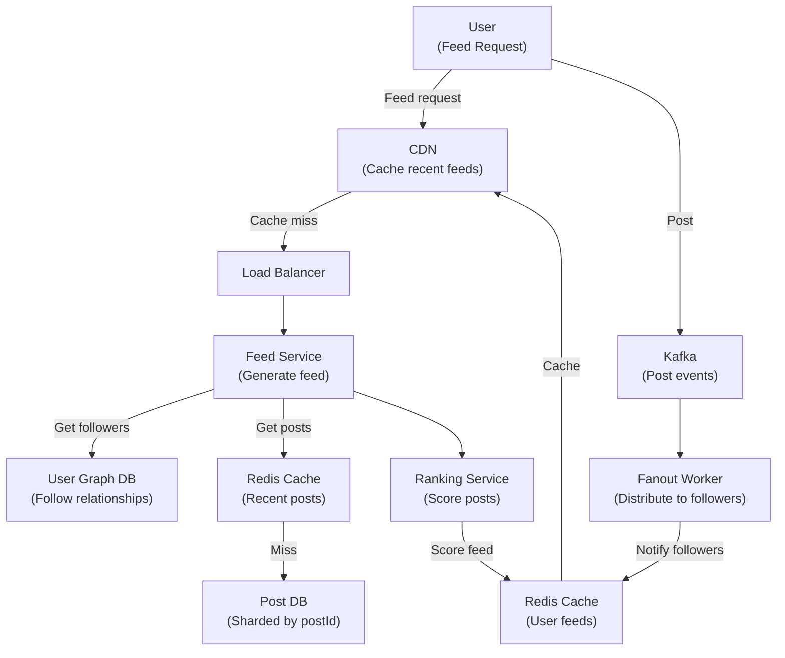

# News Feed & Social Timeline

*Design a social media feed system like Facebook News Feed, Twitter Timeline, or Instagram Home Feed. Billions of posts, complex personalization, real-time updates.*

## Problem Statement

Design a system that generates personalized news feeds for 500M daily active users. Each user follows ~500 accounts, feeds refresh constantly, must show latest posts. Think Instagram/Twitter scale: 100M+ QPS peak, sub-1-second feed load.

---

## Clarifying Questions & Requirements

### Functional Requirements
- Post creation (text, images, videos)
- User follow/unfollow
- Feed generation (personalized, chronological + ranking)
- Like, comment, share
- Real-time updates (new posts appear in feed within seconds)

### Non-Functional Requirements
- **Scale**: 500M DAU, 100M+ QPS peak
- **Latency**: Feed load < 1s, post publish < 5s
- **Consistency**: Eventual consistency acceptable (eventual = ok)
- **Availability**: 99.9% uptime
- **Data**: 100M posts/day, 1KB average per post

---

## Scale Estimation

| Metric | Calculation | Result |
|---|---|---|
| **DAU** | 500M | 500,000,000 |
| **QPS (feed reads)** | 500M × 0.5 feeds/min / 60 | 4.1M QPS |
| **QPS (post writes)** | 4.1M × 0.02 (2% write ratio) | 82k QPS |
| **Storage (posts)** | 100M posts/day × 1KB | 100GB/day, ~36TB/year |
| **Bandwidth (feed)** | 4.1M QPS × 50KB avg | 205 GB/s (!!) |

**Key insight**: Feed reads are enormous (4M+ QPS). Caching is critical.

---

## High-Level Design



---

## Deep Dive: Feed Generation Strategy

### Challenge: Fan-Out Problem

```
User 1 has 10M followers
User 1 posts
Must notify 10M followers' feeds (write-amplification!)
```

### Two Approaches

#### 1. Write-On-Read (Pull Model)

```
Post published: Store in post DB only
User requests feed:
  SELECT posts FROM posts
  WHERE creator IN (user's followees)
  ORDER BY timestamp DESC
  LIMIT 100

Pros: No write amplification, simple
Cons: Feed generation slow (multiple JOINs, billions of posts)
```

#### 2. Write-Behind (Push Model / Fanout-On-Write)

```
Post published: Store in post DB
Publish to Kafka: {postId, creatorId}

Fanout worker subscribes:
  For each follower of creator:
    Add post to follower's feed cache
    Followers' feed cache updated within seconds

User requests feed:
  Get from cache (pre-computed!)
  Super fast (cache hit = ~5ms)

Pros: Feed load is instant (cache hits)
Cons: Write amplification (but async, doesn't block writer)
```

### Hybrid: Push + Pull

For most users (push model):
- Posts fanout to followers' feeds asynchronously
- Feed load is fast (cache)

For celebrity users (1M+ followers):
  - Too expensive to fanout (1M writes for each post)
  - Use pull model for celebrities (accept slower feed)
  - OR push to top 10k followers only (heavy users)

---

## Feed Ranking

After fetching posts, rank them (not just chronological):

```
Score = f(recency, engagement, relevance)

recency_score = 1 / (hours_since_post + 1)
engagement_score = (likes + 10×comments + 50×shares) / totalReach
relevance_score = user_interest_in_creator
  (if user liked creator's posts before)

final_score = 0.4×recency + 0.4×engagement + 0.2×relevance

Sort by final_score, return top 100
```

---

## Caching Strategy

### Multi-Level Cache

```
Level 1: CDN (global)
  Cache entire feed for 60s
  Hit rate: 60-80% (same feed for 10k users)

Level 2: Redis (regional)
  Cache user feed for 24h
  Hit rate: 90%+

Level 3: Database
  Only on cold start or miss
```

### Cache Invalidation

```
When user posts:
  Invalidate user's own feed (they see new post immediately)
  Don't invalidate followers' caches (fanout updates them)

When user follows someone:
  Invalidate user's feed (new posts from followee now visible)
```

---

## Bottlenecks & Scaling

### At Current (100M+ QPS)

**Bottleneck**: Feed ranking service (CPU-intensive scoring).

**Solution**: 
- Pre-compute scores offline (Spark job, update hourly)
- Cache rankings

### At 10x (1B QPS)

**Bottleneck**: Kafka throughput (fanout queue backlog).

**Solution**:
- Increase Kafka partitions
- Shard fanout by geographic region
- Batch fanout (wait 100ms, fanout 10M updates in one batch)

### At 100x (10B QPS)

**Bottleneck**: Database (even with sharding).

**Solution**:
- TimeSeries DB (ClickHouse, Druid) for post events
- Archive old posts to cold storage
- Age-based sharding (recent posts on hot tier)

---

## Failure Scenarios

### Post Service Outage

If post DB down: Pull model impossible.

**Mitigation**:
- Serve from cache (staleness acceptable for feed)
- Auto-fallback to 24-hour-old feed

### Fanout Worker Failure

Posts don't reach some followers' caches.

**Mitigation**:
- Pull model as fallback (slower but works)
- Replay fanout job on retry (idempotent)

---

## Trade-offs

| Choice | Alternative | Rationale |
|---|---|---|
| **Push model** | Pull model | Faster feed load (cache hits), async doesn't block writers |
| **Cache + eventual consistency** | DB + strong consistency | Consistency not critical for feed (users expect slight lag) |
| **Ranking service** | Pure chronological | Ranking increases engagement (business metric) |
| **Fanout-on-write** | Fanout-on-read | Pre-computation is faster for reads |

---

## Related Fundamentals

- [Caching](../fundamentals/caching/) – Cache strategy, invalidation
- [Databases](../fundamentals/databases/) – Sharding by creatorId or postId
- [Messaging](../fundamentals/messaging-and-streaming/) – Kafka fanout
- [Batch Processing](../fundamentals/batch-and-stream-processing/) – Ranking computation

---

**Status**: ✅ Complete. Shows complex read-heavy system with caching, ranking, fanout.
