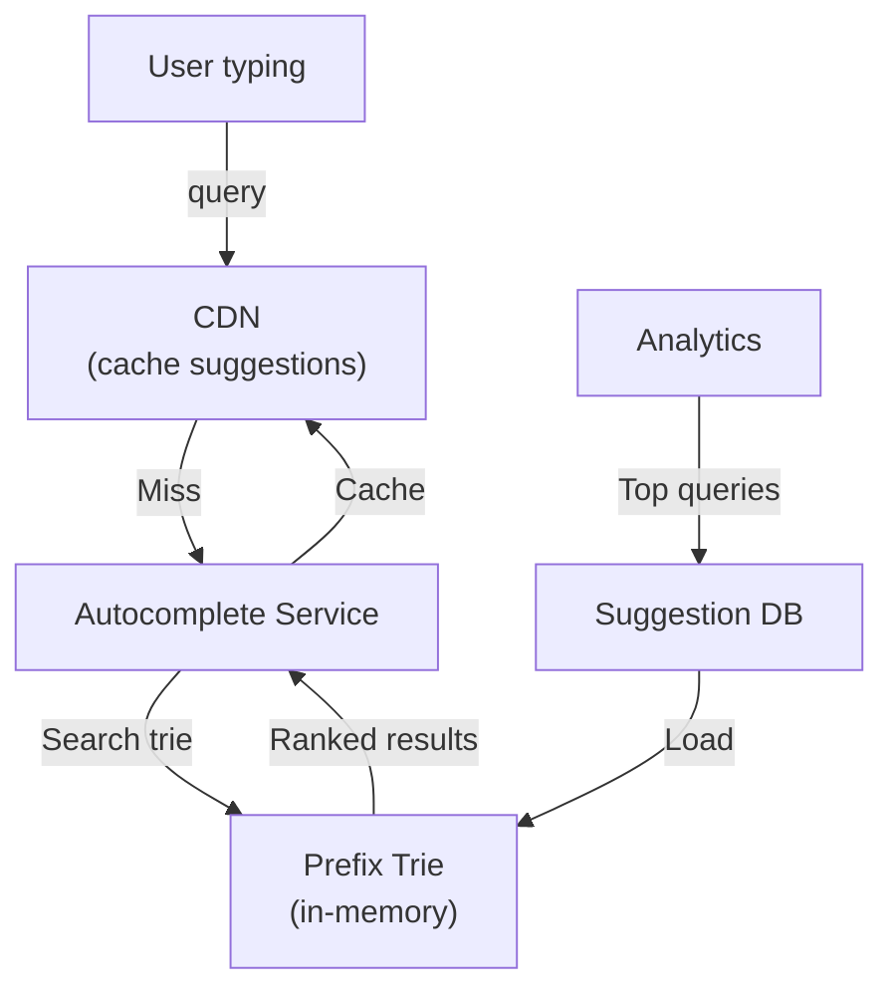

# Search Autocomplete / Typeahead

*Design a search autocomplete system like Google Search, Airbnb search suggestions. Billions of queries, sub-100ms latency, real-time suggestions.*

## Problem Statement

Build autocomplete for 500M users. 1M autocomplete queries/sec (suggestions as user types). Suggestions must be relevant, fresh, and delivered in < 50ms. Think Google's "Did you mean" or Airbnb's destination search.

## Scale Estimation

| Metric | Calculation | Result |
|---|---|---|
| **QPS** | 1M suggestions/sec | High throughput |
| **Storage** | Top 10M search terms × index | ~100GB |
| **Latency** | P99 < 50ms | Real-time |

## High-Level Architecture



## Key Algorithm: Prefix Trie

Store top 10M search terms in a trie data structure for O(P) prefix lookup (P = prefix length).

```
Trie node:
  {
    char: 'a',
    children: {
      'p': { char: 'p', children: {...} },
      'b': { char: 'b', children: {...} },
    },
    topSearches: [  // Top 10 searches with this prefix
      {query: "apple", count: 1000000},
      {query: "application", count: 500000},
      ...
    ]
  }

Search "app":
  Navigate: root -> 'a' -> 'p' -> 'p'
  Return: topSearches of node 'app' = ["apple", "application", ...]
  Latency: O(P + K) where P = prefix length, K = number of results
```

## Ranking: Frequency + Recency

```
Score = frequency × (1 - decay_factor)

frequency = search_count
decay_factor = e^(-age_days / half_life)
  (older searches decay exponentially)

Example:
  "apple" searched 1M times (1 year old): score = 1M × 0.5 = 500k
  "new trend" searched 100k times (1 day old): score = 100k × 0.99 = 99k
  
Top 10 by score = displayed suggestions
```

## Bottlenecks & Scaling

**Bottleneck**: Trie fitting in memory (10M terms, 100GB).

**Solution**:
- Partition trie by prefix (shard by first 1-2 chars)
- Each shard handles 1M terms, fits in ~10GB
- Multi-shard deployment across servers

## Trade-offs

| Choice | Alternative | Rationale |
|---|---|---|
| **Trie** | Database queries | Trie lookup is O(P), DB is O(log N) |
| **Offline indexing** | Real-time | Batch index hourly, fast enough |
| **CDN caching** | No caching | Same prefix queried millions of times |

---

**Status**: ✅ Complete. Shows indexing, ranking, caching strategy.
