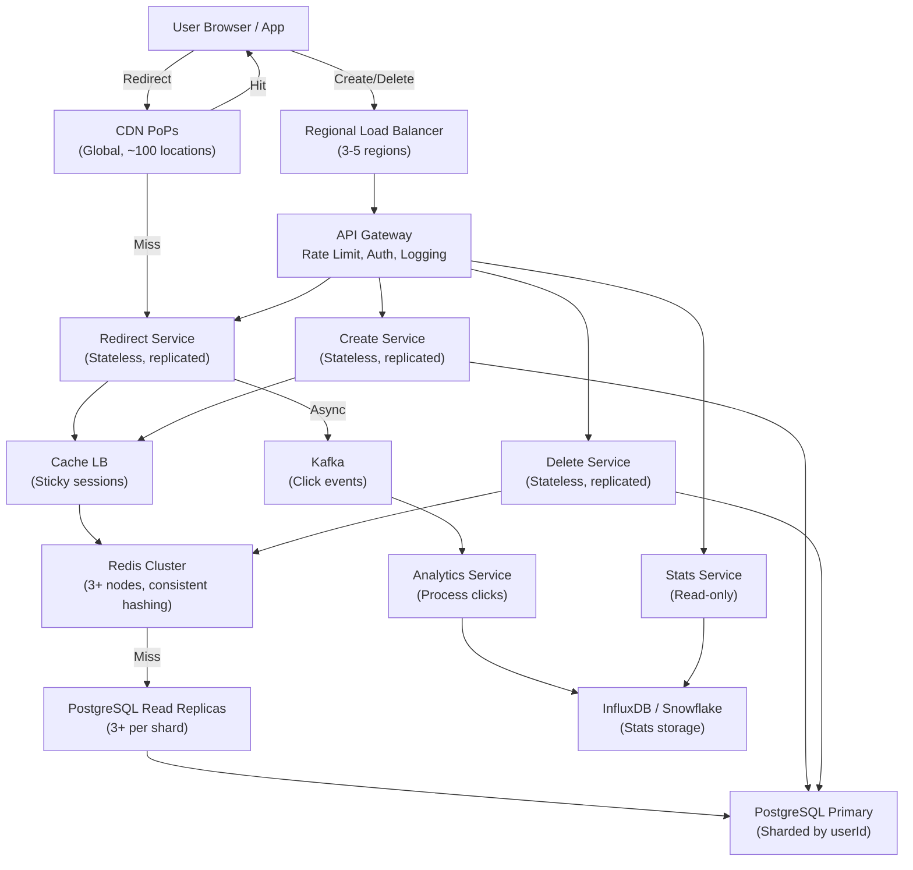
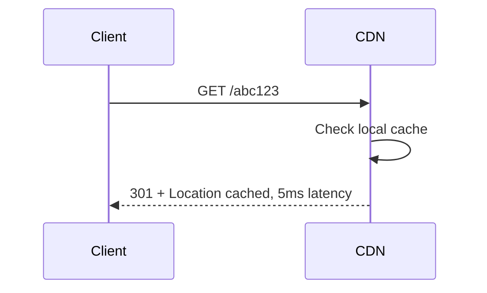
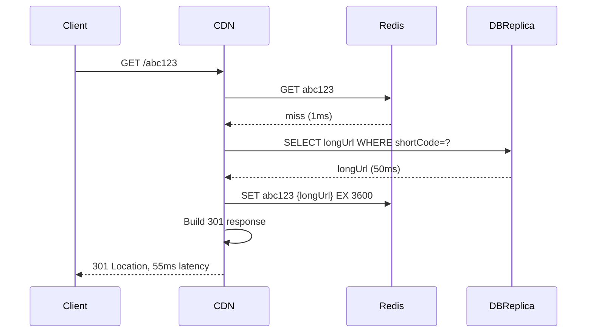

# URL Shortener

*Follow the [Problem-Solving Framework](00-problem-solving-framework.md) while reading this case study.*

## Problem Statement

Design a URL shortening service like bit.ly. Users submit long URLs (2000 char limit) and receive short aliases (6-8 characters) that redirect to the original. The system must handle millions of users, billions of shortened URLs, and serve redirects at sub-100ms latency globally.

---

## Clarifying Questions & Requirements

### Functional Requirements

- Create a short URL from a long URL
- Redirect from short URL to original (HTTP 301)
- Delete a shortened URL (user can remove their own)
- Get statistics (click count, geographic distribution)
- Custom aliases (optional, e.g., bit.ly/my-campaign)

### Non-Functional Requirements

- **Scale**: 100 million DAU, 1 billion URLs created over 5 years
- **Read/Write ratio**: 10:1 (most traffic is redirects)
- **Latency**: P99 < 100ms for redirects, P99 < 500ms for creates
- **Availability**: 99.95% uptime
- **Consistency**: Eventual consistency acceptable for analytics. Redirects must be immediately consistent.
- **Geographic scope**: Global (users and content in multiple regions)

---

## Scale Estimation

### Assumptions

- 100M DAU
- Each user creates 1 short URL per week
- Each short URL followed 10 times on average (80/20 rule: 20% of URLs are 80% of traffic)
- Peak traffic is 5x average

### Calculations

| Metric | Calculation | Result |
|---|---|---|
| Creates/sec (avg) | 100M DAU × (1/week) / (7 × 86400s) | ~165 QPS |
| Creates/sec (peak) | 165 × 5 | ~825 QPS |
| Redirects/sec (avg) | 165 QPS × 10 follows | ~1650 QPS |
| Redirects/sec (peak) | 1650 × 5 | ~8250 QPS |
| Storage (1 year) | 100M creates/year × 0.5 KB per record | ~50 GB |
| Storage (5 years) | 50 GB × 5 | ~250 GB |
| Bandwidth (redirects) | 8250 QPS × 1 KB | ~8 MB/sec |

**Insight**: Read-heavy (90% redirects), so optimize for redirect latency with heavy caching.

---

## API Design

```
POST /api/shorten
Request: { 
  longUrl: string (max 2000 chars),
  customAlias?: string,
  expiryDays?: int,
  userId: int64
}
Response: { 
  shortCode: string,
  shortUrl: string,
  createdAt: int64,
  expiresAt?: int64
}
Error: 400 (invalid URL), 409 (alias taken), 401 (unauthorized), 503 (unavailable)
Idempotent: No (multiple calls create multiple short codes)

GET /{shortCode}
Request: (path parameter)
Response: HTTP 301 Moved Permanently
Location: {longUrl}
Error: 404 (not found), 410 (expired), 503 (unavailable)
Idempotent: Yes

DELETE /api/{shortCode}
Request: { userId: int64 }
Response: { success: bool }
Error: 404, 403 (not owner), 401 (unauthorized), 503
Idempotent: Yes

GET /api/{shortCode}/stats
Request: (path parameter)
Response: { 
  shortCode, 
  longUrl, 
  createdAt,
  clicks: int64,
  topCountries: [{ country, count }],
  topReferrers: [{ referer, count }]
}
Error: 404, 403, 503
Idempotent: Yes (read-only)
```

---

## Data Model

### Entities

```
ShortURL {
  id (PK): int64
  shortCode (Unique): varchar(10)  // 6-8 base62 chars
  longUrl: varchar(2000)
  userId (FK): int64
  createdAt: timestamp
  expiresAt: timestamp (nullable)
  isDeleted: bool (soft delete for audit)
}

ClickEvent {
  id (PK): int64
  shortUrlId (FK): int64
  timestamp: timestamp
  country: varchar(2)
  referer: varchar(2000)
  userAgent: varchar(500)
}

User {
  id (PK): int64
  email: varchar(255, unique)
  username: varchar(50, unique)
  createdAt: timestamp
  tier: enum(free, premium)  // Premium users get custom aliases, analytics
}

CustomAlias (optional, premium feature) {
  aliasId (PK): int64
  userId (FK): int64
  alias: varchar(50, unique)
  shortUrlId (FK): int64
  claimedAt: timestamp
}
```

### Indexes

```
ShortURL:
  - PK: id
  - Unique: shortCode
  - Index: userId + createdAt (list user's URLs)
  - Index: expiresAt (cleanup expired URLs)

ClickEvent:
  - PK: id
  - FK: shortUrlId + timestamp (stats queries)
  - Partition by date (7-day retention, daily cleanup)

User:
  - PK: id
  - Unique: email, username
```

### Storage Choice

**Primary DB**: PostgreSQL (or MySQL)
- Relational model, strong ACID for URL creation/deletion
- Sharded by userId for horizontal scale
- Read replicas for analytics queries

**Cache**: Redis
- Cache hot short codes (top 1% of URLs = 90% of traffic) with LRU eviction
- Cache recently created URLs (1-hour TTL to catch double-creates)
- Distributed Redis cluster with consistent hashing by shortCode

**Analytics**: Time-series DB (InfluxDB) or DW (Snowflake)
- Click events flow asynchronously to analytics pipeline
- Separate from main DB to avoid impacting redirects

**CDN**: CloudFront or Akamai
- Cache redirects at edge globally, serve 301 locally
- Cache header: `Cache-Control: public, max-age=2592000` (30 days)
- ETag validation for freshness

---

## High-Level Architecture



### Component Responsibilities

- **CDN**: Caches redirects (301s) at edge, geographically distributed
- **API Gateway**: Rate limiting (prevent abuse), authentication, request logging
- **Create Service**: Generates short codes, validates URL, writes to DB, populates cache
- **Redirect Service**: Looks up short code in cache/DB, returns 301
- **Delete Service**: Soft-delete (audit trail), invalidate cache
- **Stats Service**: Read-only queries to analytics DB, serves click stats
- **Redis Cluster**: Distributed cache with consistent hashing, LRU eviction
- **PostgreSQL**: Sharded by user ID, primary handles writes, replicas handle reads for stats
- **Kafka**: Decouples click events from redirect path (async processing)
- **Analytics**: Aggregates click counts, geographic/referrer distribution

---

## Deep Dive

### 1. Short Code Generation

**Challenge**: Generate unique, URL-safe, short codes efficiently. 

**Approach**: Auto-increment ID + base62 encoding

```
Database auto-increment: 1, 2, 3, 4, ..., 1000000
Base62 encode:
  1 → A, 2 → B, ..., 61 → z, 62 → 10, 63 → 11, ...
  1000000 → (base62) → 4eSa

Result: Guaranteed unique, cannot collide, sequential but not guessable (base62 obscures order).
```

**Why base62**: URL-safe characters (A-Z, a-z, 0-9), 62^6 = 56B codes (more than enough for billions).

**Alternative considered**: Random generation with collision retry. Rejected because collision probability grows with scale (1B URLs = 0.002% collision chance), adds retry latency.

**Sequence diagram (create)**:

```mermaid
sequenceDiagram
    Client ->> Gateway: POST /api/shorten {longUrl}
    Gateway ->> Create: Request (with userId)
    Create ->> Create: Validate URL (protocol, length)
    Create ->> PrimaryDB: INSERT ShortURL (longUrl, userId)
    PrimaryDB -->> Create: Auto-increment ID
    Create ->> Create: shortCode = base62_encode(ID)
    Create ->> Cache: SET shortCode → longUrl (1h TTL)
    Create ->> CDN: Purge or rely on default cache headers
    Create -->> Gateway: {shortCode, shortUrl}
    Gateway -->> Client: 200 OK
```

### 2. Redirect Serving (Critical Path)

**Challenge**: Serve 8250 QPS peak with <100ms P99 latency. Database queries are 100-150ms slow.

**Solution**: Multi-layer caching + read replicas + CDN.

**Layers** (in order of check):

```
1. Browser cache: If user cached it locally (rare for short links)
2. CDN cache (PoP closest to user): 80% hit rate expected (hot URLs cached globally)
3. Redis cache: 15% hit rate (recently created URLs, hot codes)
4. PostgreSQL read replica (local region): ~5% hit rate (cold URLs)
5. PostgreSQL read replica (another region): <1% (disaster scenario)
```

**Hit rates and latency**:

| Layer | Hit Rate | Latency | Cumulative Hit % | Cumulative P99 |
|---|---|---|---|---|
| CDN | 80% | 5ms | 80% | 5ms |
| Redis | 15% | 5ms | 95% | 5ms |
| DB replica | ~5% | 50ms | ~100% | 50ms |

**Result**: P99 latency ≈ 50ms (from DB replica), P95 ≈ 5ms (from cache).

**Sequence diagram (redirect hit)**:



**Sequence diagram (redirect miss)**:



### 3. Preventing Thundering Herd

**Problem**: When a hot URL's cache expires (after 1 hour), or a viral URL suddenly needs to load, multiple concurrent requests all miss → cascade of DB queries.

**Mitigation 1: Probabilistic Early Refresh**

```
Access count on key at 59 minutes:
  With probability P=0.1:
    Trigger async refresh (fetch from DB in background)
    Return cached value immediately (no blocking)
  Else:
    Return cached value

Effect: By the time actual expiration hits at 60 min, key is refreshed.
Downside: Wastes some DB queries on low-traffic keys.
```

**Mitigation 2: Distributed Lock**

```
Client 1: Cache miss on 'abc123'
Client 1: Try SETNX abc123:lock "true" EX 5 → Success
Client 1: Fetch from DB (takes 50ms), store result
Client 2: Cache miss on 'abc123'
Client 2: Try SETNX abc123:lock → Fail (Client 1 holds it)
Client 2: Wait/poll for lock release (max 5s)
Client 1: Stores result, releases lock
Client 2: Lock released, finds cached value, serves immediately

Result: 1 DB query instead of N concurrent queries.
```

### 4. Sharding Strategy

**Challenge**: Single PostgreSQL cannot handle 825 peak QPS writes.

**Strategy**: Shard by userId

```
ShardNumber = hash(userId) % numShards

User 100: hash(100) % 10 = 3 → Shard 3
User 101: hash(101) % 10 = 7 → Shard 7

Each shard:
  - 1 primary (handles writes for that shard's users)
  - 2 replicas (read-only, handle stats queries)
  - Consistent replication (strong consistency for a user's own data)
```

**Load distribution**:

- 825 peak QPS / 10 shards = ~83 QPS per shard primary
- Each primary can handle 1000+ QPS easily
- Headroom for 10x growth

**Hot spots**: Celebrity users create lots of URLs. Mitigation:
- Cache their URLs aggressively (LRU, so frequently accessed = never evicted)
- Micro-shard: If user creates 1000x more than average, shard their data separately

**Resharding**: Adding new shards is complex:
1. Double-write: New writes go to old + new shard
2. Backfill: Scan old shard, copy to new shard
3. Verify: Check both match
4. Cutover: Redirect reads to new shard
5. Cleanup: Drop old shard

Downtime: 0 if done carefully (gradual cutover).

---

## Bottlenecks & Scaling

### At 10x (8.25k create QPS, 82.5k redirect QPS peak)

**Bottleneck**: Single Redis node can't handle 82.5k QPS.

**Solution**: Redis Cluster (3+ nodes with consistent hashing).
- Each short code hashes to a node
- 82.5k QPS / 3 nodes = ~27.5k QPS per node (manageable)
- On node failure, replicas take over

### At 100x (82.5k create, 825k redirect QPS peak)

**Bottleneck**: Read replicas saturated. Database I/O limit.

**Solution**: 
- Add more replicas per shard (5-10 replicas)
- Partition short codes temporally: Recent URLs (< 7 days) on replica 1, older on replica 2
- Route redirects to appropriate replica based on age

### At 1000x (825k create, 8.25M redirect QPS peak)

**Bottleneck**: PostgreSQL I/O is maxed. Single-machine DB can't keep up.

**Solution**: Migrate from PostgreSQL to NoSQL (DynamoDB, Cassandra).
- Write model: Partitioned by shortCode, eventual consistency
- Read model: Separate analytics DB for stats (DW like Snowflake)
- Still cache aggressively to reduce DB load

---

## Trade-offs & Alternatives

| Choice | Alternative | Rationale |
|---|---|---|
| PostgreSQL + sharding | NoSQL from start (DynamoDB) | PostgreSQL handles our current scale with sharding, strong ops, ACID for deletes. Migrate to NoSQL only if scale demands it. |
| Hash-based sharding | Range-based | Hash distributes evenly, avoids hot spots. Range (user IDs 1-100 on shard 1) groups sequential users, causing load skew. |
| Base62 encoding | UUID | Base62 is compact (6 chars vs 36). Trade-off: sequential IDs leak info, but we obscure with encoding. |
| CDN caching | No CDN, replicate DB globally | CDN is simpler, cheaper per-region. Global DB replication has consistency complexity. |
| Soft deletes | Hard deletes | Soft deletes preserve audit trail (who deleted, when). Hard deletes are instant but lose history. |
| Async click events | Sync analytics | Async prevents click logging from blocking redirects. Eventual consistency is fine for analytics. |

---

## Failure Scenarios & Mitigations

### Primary Database Failure

**Scenario**: PostgreSQL primary in us-west-2 fails. Write traffic halts.

**Mitigation**:
- Continuous replication to standby replica in same zone
- Automated failover on 3 health check failures (~15 sec)
- Manual override if needed

**RTO**: ~15 sec  
**RPO**: ~5 sec (loses recent writes)

### Redis Cluster Node Failure

**Scenario**: Redis node with shard 3 data goes down.

**Mitigation**:
- Cluster promotes replica node to primary (automatic, ~5 sec)
- Clients redirected to new primary
- Database can absorb 10% of requests without cache (degradation acceptable)

**RTO**: ~5 sec  
**RPO**: 0 (data replicated)

### Regional Outage

**Scenario**: us-west-2 region (primary + cache + DB) goes down.

**Mitigation**:
- GeoDNS redirects to eu-west-1 (secondary region with replicated data)
- Secondary region takes traffic
- **Trade-off**: Higher latency from far regions (~100ms instead of ~5-10ms locally), eventual consistency on reads

**RTO**: ~30 sec (DNS + connection reestablishment)  
**RPO**: ~1-2 sec (async replication lag)

### Cache (Redis) Failure

**Scenario**: All Redis nodes down. Cache layer gone.

**Mitigation**:
- Database is sized to handle 10% of requests without cache (8250 QPS peak / 10 = 825 QPS to DB)
- 825 QPS is manageable for DB, but slow (100ms latency instead of 5ms)
- Users experience ~100ms redirects vs usual ~5-10ms
- Alert on-call to restart cache (usually fast, 2-3 min to spin up new instance)

**Availability**: Degraded (slow, but functional)

---

## Interviewer Follow-up / Twist Questions

### Q1: "What if we need 99.999% availability (five nines)?"

**Hint**: Single points of failure must be eliminated.

**Approach**:
- Multi-region active-active: Both regions accept writes (eventually consistent)
- Conflict resolution: Last-write-wins (LWW) for URL creation (rare conflicts, acceptable)
- Async replication between regions (< 100ms lag)
- Trade-off: Consistency (eventual vs strong)

### Q2: "How would you handle spam (someone creating 1M short URLs to launch a DDoS)?"

**Hint**: Rate limiting at multiple layers.

**Approach**:
- Per-user rate limit: 100 URLs/hour (API gateway)
- Per-IP rate limit: 10k URLs/hour (load balancer)
- Captcha after N failures
- Abuse detection: Spike in new URLs from one user, block temporarily

### Q3: "What if URLs expire, but users expect them to never expire?"

**Hint**: Default expiry vs user expectation.

**Approach**:
- Make expiry optional (default: never)
- Premium users get longer retention (1 year+)
- Free users: 90-day auto-expiry (save storage)
- Notification: Email user 7 days before expiry with option to renew

### Q4: "How would you implement analytics without impacting the redirect path?"

**Hint**: Async processing.

**Approach**:
- On redirect, emit click event to Kafka (< 1ms, non-blocking)
- Kafka topic: `url-shortener-clicks`
- Analytics service subscribes, aggregates into time-series DB
- Stats API queries time-series DB, not transaction DB
- Separation of concerns: Transaction DB fast (small dataset), analytics DB scalable (large dataset)

### Q5: "What if someone wants to track which browser/OS users are using?"

**Hint**: Extend schema, careful with storage.

**Approach**:
- Collect `User-Agent` on click (included in ClickEvent schema)
- Parse User-Agent (browser, OS) in analytics service
- Store in time-series DB with dimensions (country, browser, OS)
- Query: "Top 10 browsers clicking this URL this week"
- Cost: More storage in analytics DB, more processing in analytics service

---

## Key Takeaways

- **Scale through caching**: Multi-layer caching (CDN + Redis + DB replicas) is the primary scaling lever.
- **Sharding for writes**: Hash-based sharding by user ID distributes load evenly.
- **Async for independence**: Click events don't block redirects (separate concern).
- **Simplicity first**: Start with single PostgreSQL, add sharding/cache only when needed.
- **Redundancy matters**: Multi-region, replicas, failover automation prevent single points of failure.
- **Trade consistency for scale**: Eventual consistency (multi-region) or immediate consistency (single region) — choose based on requirements.

---

## Related Fundamentals

- [Capacity Planning & Estimation](../fundamentals/capacity-planning-and-estimation/) – Back-of-envelope math
- [Databases](../fundamentals/databases/) – Sharding, replication, indexing
- [Caching](../fundamentals/caching/) – Multi-layer caching strategy
- [Distributed Data Structures](../fundamentals/distributed-data-structures/) – Consistent hashing for Redis cluster
- [Content Delivery & Edge](../fundamentals/content-delivery-and-edge/) – CDN caching of redirects
- [Scalability & Load Balancing](../fundamentals/scalability-and-load-balancing/) – Multi-region, load balancing

---

**Status**: ✅ Complete. Reference implementation using the problem-solving framework.
