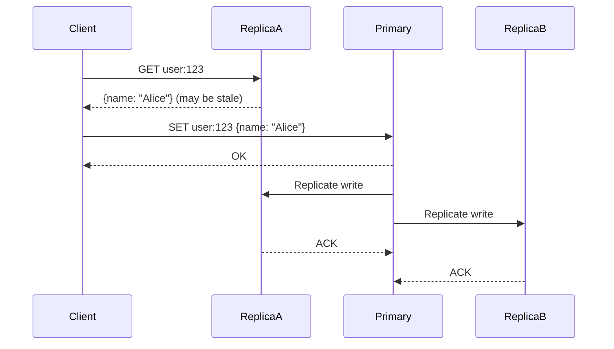

# Distributed Caching

## TL;DR

- **Consistent Hashing**: Distributes keys across cache nodes. On node failure, only 1/N of keys need to rehash.
- **Replicated Caches**: Each node has full copy (memory-intensive). Good for redundancy, bad for scale.
- **Partitioned Caches**: Keys distributed across nodes (efficient). If node fails, that shard's data is lost.
- **Read-Replicated**: Primary node handles writes, replicas handle reads. Best of both worlds if read-heavy.
- **Choice**: Partitioned + replicas for production (balance scale and durability).

## Consistent Hashing

The foundation of distributed caches. Maps keys to nodes deterministically, minimizing reshuffling on node changes.

### Basic Hashing (Naive)

```
node_index = hash(key) % num_nodes

Problem: If num_nodes changes (add/remove node), all keys remap.
Example: num_nodes=3, key "user:123" → hash()%3=1 → node 1
         Add node 4: num_nodes=4, key "user:123" → hash()%4=1 → STILL node 1 (lucky)
         But hash()%4 changes for most keys, causing cache invalidation for 2/3 of keys.
```

### Consistent Hashing

Map both keys and nodes to a ring (0 to 2^32-1). Key maps to the next node clockwise.

```
Ring (simplified, 0-360 degrees):

    Node B (100°)
        |
        |
Node C (250°) --- Node A (20°)

Key "user:123" hashes to 50° → maps to Node A (next clockwise)
Key "post:456" hashes to 150° → maps to Node B (next clockwise)

Add Node D at 180°:
- Key at 50° still → Node A (no change)
- Key at 150° now → Node D (was Node B, moved)
- Key at 200° still → Node C (no change)
- Key at 300° still → Node C (no change)

Result: Only 1/3 of keys move, not 2/3.
```

### Virtual Nodes

To balance load (handle uneven node capacity), use **virtual nodes**. Each physical node has multiple positions on the ring.

```
Physical Nodes: A, B, C
Virtual Nodes: A-1, A-2, ..., A-k, B-1, ..., B-k, C-1, ..., C-k

Effect: If Node A is removed, its virtual nodes redistribute to neighboring nodes evenly.
```

### Pros

- **Minimal reshuffling**: Adding/removing a node only affects 1/N of keys.
- **Load balancing**: Virtual nodes ensure balanced distribution across heterogeneous hardware.
- **Scalability**: Can grow/shrink cluster without full cache invalidation.

### Cons

- **Uneven distribution without virtual nodes**: Hash function might cluster keys to a few nodes.
- **Imbalanced loads**: Even with virtual nodes, some nodes can get more traffic (hot spots).

---

## Cache Topologies

### 1. Replicated Cache (Full Copy)

Every node has a complete copy of all data.

```
Node A: [user:1, user:2, ..., user:N]
Node B: [user:1, user:2, ..., user:N]
Node C: [user:1, user:2, ..., user:N]

Read: Any node, O(1) latency
Write: All nodes must update (broadcast)
```

**Pros**: Read scalability, fault tolerance (any node can serve any key).  
**Cons**: Write scalability (O(N) latency), memory waste (N copies of same data), consistency complexity.

**When used**: Small datasets (< 1GB per node), write-light systems.

---

### 2. Partitioned Cache (Sharded)

Keys distributed across nodes via consistent hashing. Each node owns a shard.

```
Node A: [user:1, user:4, user:7, ...]  (keys hash to A)
Node B: [user:2, user:5, user:8, ...]  (keys hash to B)
Node C: [user:3, user:6, user:9, ...]  (keys hash to C)

Read: Route to shard owner
Write: Route to shard owner
```

**Pros**: Write scalability (O(1) latency per shard), memory efficiency (no duplication).  
**Cons**: Single point of failure per shard (node crash = data loss), limited read parallelism.

**When used**: High-throughput systems (millions QPS), large datasets (100s GB).

---

### 3. Read-Replicated (Primary + Replicas)

Primary node handles writes, replica nodes handle reads.

```
Primary Node A: [user:1, user:4, ..., source of truth for writes]
Replica Node B: [user:1, user:4, ..., stale copy, reads only]
Replica Node C: [user:1, user:4, ..., stale copy, reads only]

Write: → Primary, then replicate async to replicas
Read: → Any replica (or primary for read-after-write)
```

**Sequence Diagram**:


**Pros**: Read scalability (many replicas), strong write consistency (primary is source of truth).  
**Cons**: Replication lag (read-after-write might be stale), complexity (need leader election on primary failure).

**When used**: Read-heavy systems (90% reads), need consistency.

---

### 4. Hybrid: Partitioned + Replicated

Combine sharding + replication. Each shard has a primary + replicas.

```
Shard 1: Primary A, Replicas B, C
Shard 2: Primary D, Replicas E, F
Shard 3: Primary G, Replicas H, I

Write to key → Partition (consistent hash) → Shard 1 Primary A
Read from key → Can read from A, B, or C
Node A failure → Failover to B or C
```

**Best of both**: Write scalability + read scalability + fault tolerance.  
**Trade-off**: Complexity (need replication + sharding coordination).

---

## Redis Cluster (Production Example)

Redis Cluster implements **partitioned + replicated** caching:

1. **Nodes**: 6+ nodes (3 primaries + 3 replicas, or N+N)
2. **Slots**: 16384 slots (0-16383). Key hashes to slot, slot assigned to primary node.
3. **Replication**: Each slot has primary owner + replica owners.
4. **Failover**: If primary fails, cluster promotes a replica to primary (automatic).
5. **Client routing**: Client can connect to any node, redirected to owner if needed (MOVED response).

**Example**:
```
SET user:123 → CRC16(user:123) % 16384 = slot 4567
Slot 4567 owned by Node A (primary), Node B (replica)
Write → Node A, replicate to B
Read → Node B (or A)
Node A fails → Node B promoted to primary for slot 4567
```

---

## Handling Hot Spots

When one partition receives disproportionate traffic (e.g., a celebrity's profile accessed 100k times/sec).

### Problem

```
Hot key: "celebrity:taylor_swift"
Consistent hash → Shard 3
Shard 3 becomes bottleneck (CPU, memory, network)
Other shards idle
```

### Solutions

1. **Replicate hot key across all nodes**: Break consistent hashing for known hot keys.
2. **Local caching**: Application-level cache (in-process) for hot keys + Redis as fallback.
3. **Micro-sharding**: Shard a single hot key across multiple cache entries (e.g., 10 copies with suffix).
4. **Rate limiting**: Cap traffic to hot key (though this reduces functionality).

**Production Example**: Instagram caches celebrity profile in **all** cache nodes, not just one shard.

---

## Failover & Durability

### Failover

If a primary node crashes, replicas take over.

```
Node A (primary for slot 1000) crashes
Replicas: Node B, Node C both have slot 1000
Cluster detects A down after 3 failed health checks
Cluster votes to promote B as new primary
Clients redirect from A → B
RTO (Recovery Time): 30 seconds
RPO (Recovery Point): near-zero if replication was synchronous
```

### Durability

Caches are volatile (data lost on restart). For durability:

1. **RDB (Redis persistence)**: Snapshot to disk periodically (can lose seconds of data on crash).
2. **AOF (Append-Only File)**: Log every write to disk (slower but more durable).
3. **Replication**: Data persisted on multiple nodes, lost only on cluster-wide failure.
4. **Hybrid**: Write-through to DB for critical data, cache for speed.

---

## Production Considerations

1. **Connection pooling**: Clients need efficient connection management (each node has limits).
2. **Key expiration**: Eviction policies apply to each shard independently. If shard is slow, evictions may lag.
3. **Metrics**: Track **hit rate per shard** (should be balanced). Skewed hit rates indicate hot spots.
4. **Backup**: Replicate cache cluster to another region for disaster recovery.
5. **Testing**: Simulate node failures, failover scenarios. Is your application ready for stale data?

---

## References

- "Consistent Hashing and Random Trees" — Karger, Lehman, Leighton, Levine, Lewin, Panigrahy
- Redis Cluster documentation
- "Memcached: A Distributed Memory Object Caching System" — Fitzpatrick

---

## Related Fundamentals

- [Distributed Data Structures](../distributed-data-structures/consistent-hashing.md) – Consistent hashing deep dive
- [Reliability & Resiliency](../reliability-and-resiliency/redundancy-and-failover.md) – Failover mechanisms
- [Scalability & Load Balancing](../scalability-and-load-balancing/) – Multi-tier caching (application + Redis + database)
