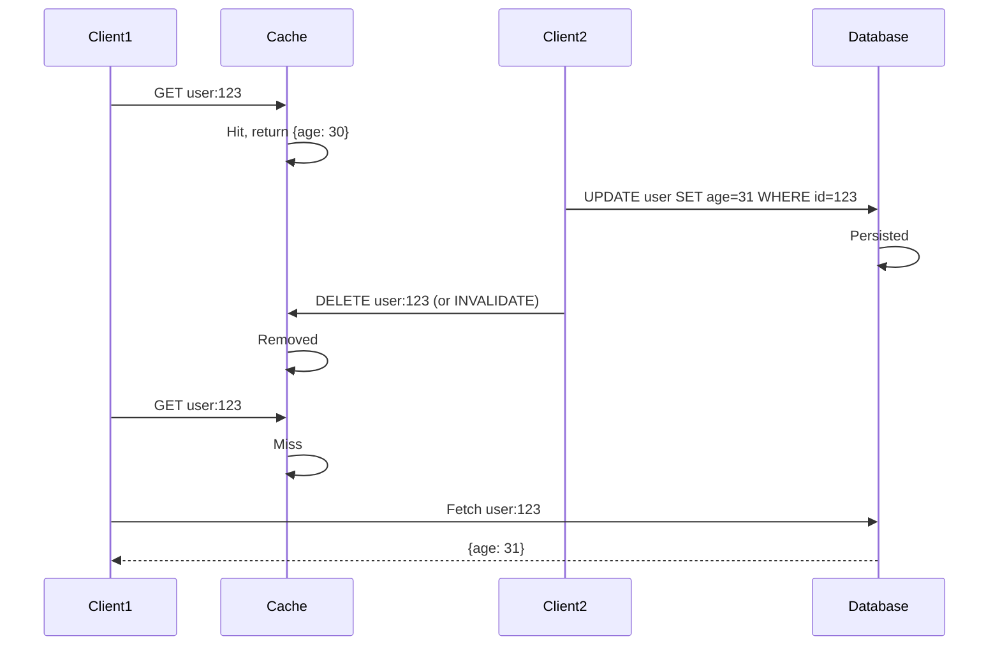

# Cache Invalidation

## TL;DR

- **Hardest problem in CS**: Phil Karlton famously said "There are only two hard things in Computer Science: cache invalidation and naming things."
- **Three approaches**: TTL-based (passive), explicit invalidation (active), write-through (synchronous).
- **Thundering herd**: Multiple requests miss simultaneously on invalidation, overwhelming origin.
- **Mitigations**: Probabilistic early refresh, distributed locking, async re-computation.
- **The meta-truth**: Avoid invalidation with versioning (v1/, v2/, etc.) instead of mutation.

---

## The Invalidation Problem

Keeping cache consistent with source is hard because:

1. **Distributed**: Multiple cache layers (CDN, Redis, application cache), each independent.
2. **Async**: Replication lag means multiple copies of data at different times.
3. **Failure**: If invalidation message is lost, cache becomes permanently stale.
4. **Performance**: Naive invalidation causes cascading misses (thundering herd).

---

## Strategy 1: TTL-Based (Passive)

Cache entries expire after a fixed duration. Freshness is bounded by TTL.

### Mechanics

```
SET key value EX 3600

At t=0: Cached
At t=1800: Still cached (fresh)
At t=3601: Expired, removed (or lazily evicted on next access)
```

### Trade-offs

| Aspect | Implication |
|---|---|
| **Staleness** | Data can be 0 to TTL seconds old |
| **Consistency** | Eventual consistency (guaranteed to be fresh within TTL) |
| **Overhead** | None (no active invalidation messages) |
| **Freshness latency** | Worst-case latency = TTL |

### When to Use

- Default strategy, simplest to reason about.
- When staleness up to TTL is acceptable (social feeds, user profiles, product listings).
- When you don't want to manage invalidation logic.

### Tuning TTL

**Too long**: Stale data frustrates users. ("Why is my like count old?")

**Too short**: Excess cache misses, origin overloaded. ("Cache miss 30% of the time, slow.")

**Rule of thumb**:
- Frequently updated data (social feed): 1-5 min
- User profiles: 10-30 min
- Product listings: 30 min - 1 hour
- Static content: 24+ hours

### Variant: Sliding Window TTL

Reset TTL on access. Hot data stays, cold data expires.

```
ACCESS: GET key
Effect: TTL resets to 3600 seconds from now
Benefit: Hot keys never expire, cold keys evict after inactivity
```

---

## Strategy 2: Explicit Invalidation (Active)

On source update, actively send invalidation messages to cache.

### Mechanics

```
1. Data changes in DB
2. Application sends DELETE message to cache
3. Cache immediately removes entry
4. Next request fetches from source, repopulates cache
```

### Sequence Diagram



### Pros

- **Immediate consistency**: Data is fresh within seconds of update.
- **No staleness**: No worst-case staleness bound (unlike TTL).

### Cons

- **Dual writes**: Application must write to DB AND cache, error-prone.
- **Cascading misses**: If multiple clients request key simultaneously after invalidation, all miss → origin overload.
- **Invalidation failures**: If DELETE message is lost, cache is permanently stale.

### Failure Scenario

```
1. UPDATE database
2. Send DELETE to cache
3. Network loss: DELETE never reaches cache
4. Cache still has old data
5. Users see stale data forever (until TTL expires or manual purge)

Mitigation: Retry queue, or hybrid approach (DELETE + short TTL fallback).
```

---

## Strategy 3: Write-Through (Synchronous)

Write to cache before responding. Cache is authoritative.

### Mechanics

```
1. Client updates source: UPDATE db SET age=31
2. Source updates and confirms
3. Client updates cache: SET user:123 {age: 31}
4. Client returns success
5. Cache and source always in sync
```

### Pros

- **Strongest consistency**: Source and cache always consistent.
- **No invalidation logic**: No DELETE messages, no TTL tuning.

### Cons

- **Dual-write complexity**: Must handle partial failures (DB succeeds, cache fails).
- **Write latency**: Client waits for both DB and cache writes.
- **Idempotency**: Must ensure writes are idempotent (e.g., with version numbers or CAS operations).

### Implementation Pitfall: Dual-Write Anomaly

```
Write to cache first:
  SET user:123 {age: 31}  → OK
  UPDATE db set age=31    → FAILS
  Result: Cache has 31, DB has 30. Stale cache on next read.

Write to DB first:
  UPDATE db set age=31    → OK
  SET user:123 {age: 31}  → FAILS
  Result: DB has 31, cache has old. Consistent with source, but stale.
```

**Solution**: Use transactional outbox pattern (See Distributed Transactions fundamentals).

---

## Strategy 4: Hybrid (TTL + Explicit)

Combine TTL and invalidation: invalidate aggressively, but TTL is safety net.

### Mechanics

```
SET key value EX 300 (5 min TTL)

On update:
  UPDATE db
  DELETE cache key (explicit invalidation)
  If DELETE fails: No problem, TTL will expire it in 5 min

If explicit DELETE is lost (network failure):
  Cache remains for up to 5 min, then expires
  No permanent staleness
```

### Pros

- **Resilience**: TTL is safety net if invalidation fails.
- **Low overhead**: Explicit invalidation is optional, TTL is fallback.
- **Immediate consistency** (usually): Most updates trigger explicit DELETE, so immediate freshness.
- **Graceful degradation**: If invalidation queue is down, TTL keeps working.

### When to Use

- Production systems where high consistency is needed but occasional staleness is tolerable.
- Default best practice.

---

## Thundering Herd Problem

Multiple requests miss cache simultaneously → origin overloaded.

### Scenario

```
Key "post:123" has 1-hour TTL, expires at t=3600.
At t=3600, 1000 users request "post:123" simultaneously.
All miss cache.
All query origin database simultaneously.
Database receives 1000x traffic spike.
Database CPU spikes to 100%, becomes slow, requests timeout.
```

### Mitigations

#### 1. Probabilistic Early Refresh

Refresh key probabilistically before TTL expires.

```
Access at t=3500 (100s before expiration):
  With probability P (e.g., 0.1):
    DELETE from cache (force refresh)
    Background worker refetches from origin
  Else:
    Return cached value

Effect: Some users trigger early refresh in background.
By t=3600, key is already fresh.
When t=3600 hits, few misses, no herd.
```

#### 2. Distributed Lock / Single Computation

Use a lock to ensure only one client fetches on miss.

```
Client 1: Cache miss on key "post:123"
Client 1: Try to acquire lock on "post:123:lock"
Client 1: Lock acquired, fetches from origin
Client 2: Cache miss, tries to acquire lock
Client 2: Lock is held, wait (or check if Client 1 is done)
Client 3: Cache miss, tries to acquire lock
Client 3: Lock is held, wait
Client 1: Fetches value, stores in cache, releases lock
Client 2: Lock acquired, value now cached, reads from cache, releases lock
Client 3: Lock acquired, value now cached, reads from cache, releases lock

Result: 1 origin query instead of 1000.
```

Implementation:
```
SET post:123:lock "computing" NX EX 10  # Acquire lock with 10s timeout

If lock acquired:
  Fetch from origin
  SET post:123 value
  DEL post:123:lock
Else:
  Wait in loop, checking cache until value appears (within 10s)
```

#### 3. Async Re-computation

On cache miss, don't re-fetch immediately. Instead, mark stale and re-populate in background.

```
Cache entry: { value: "...", stale: true, fetchedAt: t }

Client accesses stale entry:
  Return stale value (fast, sub-10ms)
  Trigger background job to refetch (async)

Background job:
  Fetches from origin
  Updates cache with fresh value

Result: Users see stale data briefly, but not blocked. Origin not overloaded.
Trade-off: Temporary staleness.

When to use: Read-heavy systems where temporary staleness is OK.
```

---

## Multi-Layer Cache Coherence

When you have multiple caching layers (application cache + Redis + CDN), invalidation becomes complex.

### Scenario

```
CDN hits → CDN cache (miss) → Redis (hit) → Origin (miss)

User updates data:
  Update origin DB
  Invalidate CDN?
  Invalidate Redis?
  Invalidate app cache?
  In what order?
```

### Problem: Cascading Invalidation

If you invalidate top-down (CDN → Redis → app), but invalidation messages arrive out of order:

```
1. Invalidate app cache: OK
2. Invalidate Redis: FAILS (network error)
3. Invalidate CDN: OK

Result: App and CDN are fresh, but Redis is stale.
User's request hits CDN miss → Redis (serves stale) → User sees stale data.
```

### Solution: Write to All Layers

Broadcast update to all cache layers simultaneously (as a transaction if possible).

```
On source update:
  Publish event: "post:123 updated"
  
Listeners:
  App cache: Invalidate locally
  Redis: DELETE key
  CDN: Purge /post/123
  
All happen roughly simultaneously. 
If one fails, others still updated.
Short TTL on all layers is safety net.
```

---

## Production Considerations

1. **Monitoring**: Track **staleness metrics** — how old is cached data on average?
2. **Invalidation lag**: How long from source update to cache refresh? Measure and alert.
3. **Test invalidation failures**: Simulate dropped invalidation messages. Does your system degrade gracefully?
4. **Cache keys**: Versioning is your friend. Instead of mutating `user:123`, use `user:123:v2`. Eliminates invalidation need.
5. **Observability**: Log cache operations (invalidations, TTL expirations) for debugging.

---

## The Meta-Strategy: Avoid Invalidation with Versioning

Instead of mutating cached data, create new versions.

```
Old approach (requires invalidation):
  GET post:123 → { title: "Hello", likes: 5 }
  UPDATE post:123 SET likes=6
  DELETE cache:post:123

New approach (versioning, no invalidation):
  GET post:123:v1 → { title: "Hello", likes: 5 }
  POST create post → post:123:v2 { title: "Hello", likes: 6 }
  GET post:123:v2 (fresh, never cached before, no invalidation needed)
```

**Benefits**:
- No invalidation logic.
- No staleness.
- Immutability simplifies reasoning.

**Cost**: More cache entries, need garbage collection of old versions.

---

## References

- Phil Karlton (often misattributed, but popularized the cache invalidation quote)
- "Cache Invalidation and Versioning" — Martin Kleppmann, "Designing Data-Intensive Applications"
- "Bloom Filters and Performance" — Memcached documentation (probabilistic early refresh)

---

## Related Fundamentals

- [Strategies](strategies.md) – How strategies interact with invalidation
- [Distributed Transactions](../distributed-transactions/) – Transactional outbox pattern for reliable invalidation
- [Reliability & Resiliency](../reliability-and-resiliency/) – Cascading failures from cache invalidation storms
