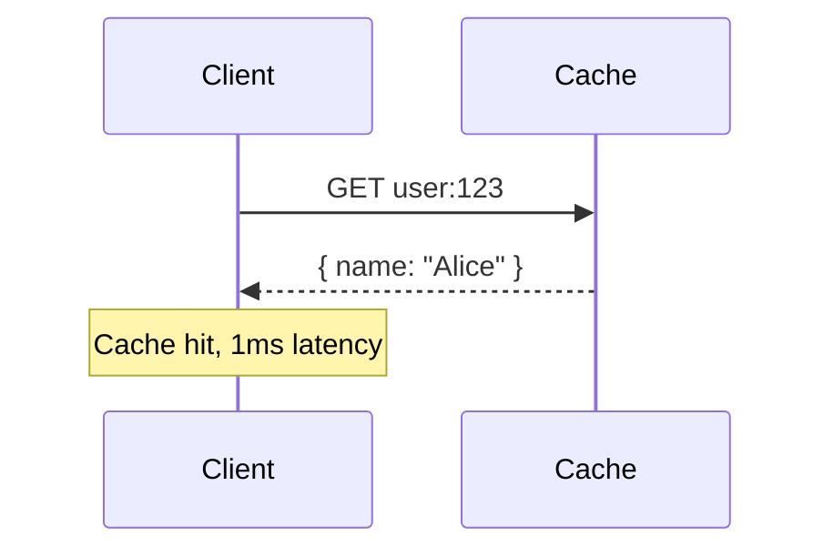
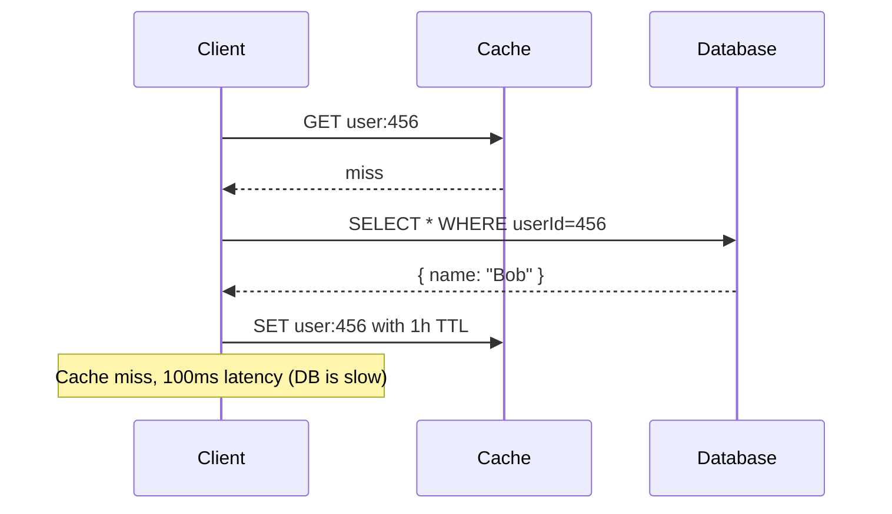
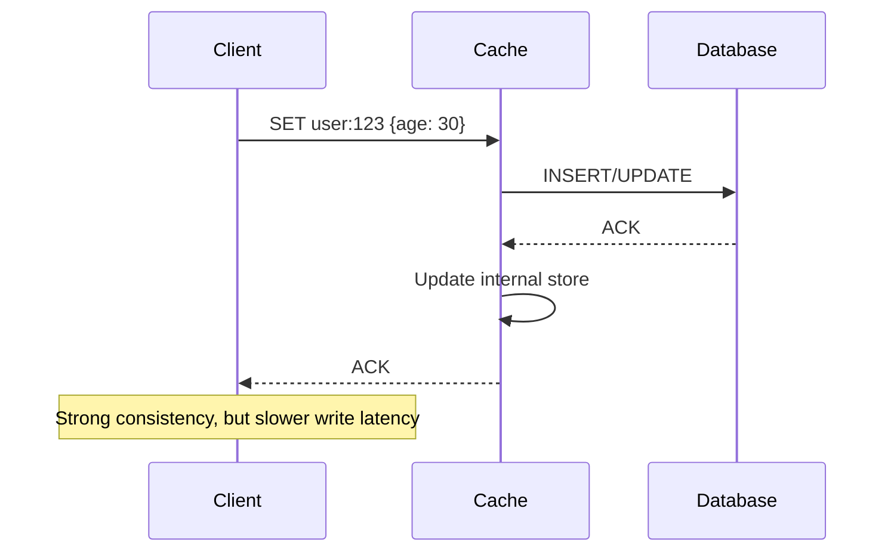
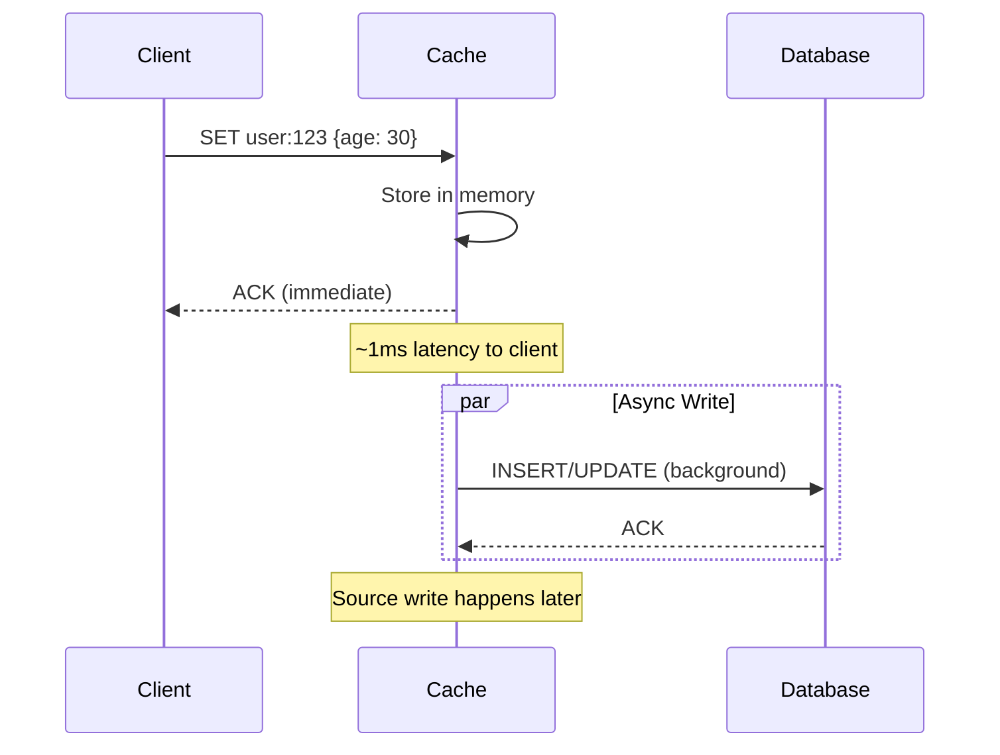

# Caching Strategies

## TL;DR

- **Cache-aside**: Client checks cache, on miss fetches from source and populates cache. Simplest, most common.
- **Read-through**: Cache is responsible for fetching from source on miss. Cleaner separation but more complex.
- **Write-through**: Writes go through cache to source, cache ensures consistency. Slower writes, simpler logic.
- **Write-behind**: Writes go to cache immediately, asynchronously sync to source. Fastest writes, risk of data loss.
- **Choice depends on**: Write ratio, consistency requirements, and acceptable staleness.

## Cache-Aside (Lazy Loading)

The dominant pattern in production systems. Client logic coordinates cache and source.

### Mechanics

```
1. Client requests data (key)
2. Check cache: if HIT → return cached value
3. On MISS:
   a. Fetch from source (DB, API, etc.)
   b. Store in cache (with TTL)
   c. Return to client
4. On WRITE:
   a. Write to source first
   b. Invalidate cache entry (or let TTL expire)
   c. Return to client
```

### Sequence Diagram (Read Hit)



### Sequence Diagram (Read Miss)



### Advantages

- **Simplicity**: Cache logic is straightforward, lives in the application.
- **Flexibility**: Different types of data can use different strategies (some cache-aside, some not cached at all).
- **Resilience**: Cache failure doesn't break the application, just slower (DB handles it).

### Disadvantages

- **Cache stampede** (thundering herd): Multiple clients miss simultaneously, all query DB at once. DB overloaded.
  - **Mitigation**: Probabilistic early refresh, lock-based re-computation, or distributed locking on cache miss.
- **Staleness**: Data can be stale by up to TTL duration.
- **Dual writes**: Client must manage both cache and source writes, increasing complexity.

### When to Use

- Most read-heavy systems (80%+ reads).
- When staleness is acceptable (social feeds, user profiles, product listings).
- When you want simplicity and operational ease.

---

## Read-Through

Cache layer handles all reads. On miss, cache itself fetches from source.

### Mechanics

```
1. Client requests data (key)
2. Send to Cache
3. Cache checks internal store
   a. HIT → return to client
   b. MISS → fetch from source internally
      - Cache handles the fetch
      - Stores in internal store
      - Returns to client (client is unaware of miss)
4. On WRITE:
   Same as cache-aside: write to source, invalidate cache
```

### Advantages

- **Cleaner separation**: Cache is responsible for source communication, client doesn't know about source.
- **Evades cache miss storms**: Cache can implement smart retry/backoff internally.
- **Better for multi-level caches**: Each layer handles its own miss logic.

### Disadvantages

- **More complex**: Cache must know how to fetch from any source (requires parameterization or plugins).
- **Harder to debug**: Client doesn't control the source query, cache logic is hidden.
- **Operational complexity**: Cache needs to be deployed and scaled independently.

### When to Use

- When you have a dedicated cache service (e.g., a caching tier shared by multiple applications).
- When you want to centralize source fetch logic.
- In CDN architectures (CDN is a read-through cache).

---

## Write-Through

Writes go through cache to source. Cache ensures consistency before returning.

### Mechanics

```
1. Client writes data
2. Send to Cache layer
3. Cache:
   a. Writes to source (DB)
   b. Waits for source confirmation
   c. Updates internal store
   d. Confirms to client
4. Only after source confirms does cache update
```

### Sequence Diagram



### Advantages

- **Strong consistency**: Cache always reflects source state (no stale data).
- **Simple logic**: No invalidation complexity, all writes go through.
- **Data safety**: Data is durable once cache confirms (written to source).

### Disadvantages

- **Slow writes**: Client waits for source write latency (100ms DB write becomes 100ms write latency).
- **Cascading failures**: If source is slow or down, all writes block.
- **Not suitable for high-throughput writes**: If you need 10k writes/sec and DB is 100ms, write-through becomes a bottleneck.

### When to Use

- When strong consistency is critical (financial transactions, inventory counts).
- When write throughput is low (100s QPS, not 1000s).
- When you can tolerate slow writes.

---

## Write-Behind (Write-Back)

Writes go to cache immediately, asynchronously sync to source.

### Mechanics

```
1. Client writes data
2. Send to Cache
3. Cache:
   a. Stores in internal memory immediately
   b. Confirms to client (fast return)
   c. Asynchronously sends to source (background job)
4. Source write happens later (seconds to minutes)
```

### Sequence Diagram



### Advantages

- **Fast writes**: Client sees sub-millisecond latency, returns immediately.
- **High throughput**: Can handle 100k+ writes/sec (all to memory, no DB latency).
- **Coalescing**: Multiple writes to same key can be batched into one source write, reducing DB load.

### Disadvantages

- **Data loss risk**: If cache crashes before writing to source, data is lost (already confirmed to client).
- **Eventual consistency**: Data is inconsistent until async write completes.
- **Complexity**: Must handle failed async writes, retries, ordering guarantees.

### Failure Scenario

```
1. Client writes "user age = 30" → Cache confirms
2. Client sees their own write (strong read-after-write)
3. Cache is still async-writing to DB
4. Cache crashes
5. "age = 30" is lost, DB still has "age = 25"
```

**Mitigation**: Persist cache writes to disk (journaling) before confirming to client, or use async queue (Kafka, SQS) instead of in-memory buffer.

### When to Use

- High-throughput write systems (social media likes, click events, metrics).
- When eventual consistency is acceptable (most user-facing data).
- When you have redundant writes or can tolerate rare data loss.

---

## Comparison Table

| Strategy | Write Latency | Consistency | Complexity | Use Case |
|---|---|---|---|---|
| **Cache-Aside** | Dual writes needed | Eventual | Low | Most systems (reads > writes) |
| **Read-Through** | Dual writes needed | Eventual | Medium | Dedicated cache tier |
| **Write-Through** | ~Source latency | Strong | Low | Transactions, inventory |
| **Write-Behind** | ~1-10ms (async) | Eventual | High | Analytics, metrics, clicks |

---

## Advanced: Hybrid Strategies

Real systems often combine strategies for different data types:

- **User profiles**: Cache-aside for reads (read-heavy), write-through for profile updates (consistency matters).
- **Social feed**: Cache-aside for reads (99% cache hit), write-behind for feed inserts (high throughput, eventual OK).
- **Inventory**: Write-through for decrements (strong consistency needed), read-through for availability data (reads only).

---

## Production Considerations

1. **Monitoring**: Track cache hit rate, miss rate, eviction rate. 80%+ hit rate is good; < 50% means your cache is too small or TTL too short.
2. **Thundering herd**: Use probabilistic early refresh, distributed locks, or queuing to prevent simultaneous source queries on cache miss.
3. **Fallback to source**: If cache is unavailable, degrade gracefully to source (client can handle higher latency).
4. **Invalidation safety**: On delete, always invalidate cache. On update, either write-through or use short TTL (~5 min).
5. **Size budgets**: Cache capacity should be 1-5% of working set (not everything). Prioritize hot data.

---

## References

- "Cache-Aside Pattern" — AWS Well-Architected Framework
- "Lazy Loading Pattern" — DynamoDB documentation
- Rajiv Sinha, "Designing Data-Intensive Applications", Chapter 3 (Storage and Retrieval)

---

## Related Fundamentals

- [Eviction Policies](eviction-policies.md) – How does cache decide what to remove when full?
- [Distributed Caching](distributed-caching.md) – Multiple cache nodes, consistent hashing
- [Cache Invalidation](invalidation.md) – How to keep cache fresh
