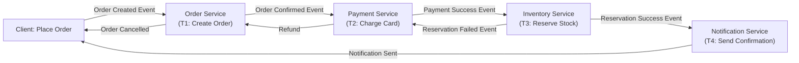
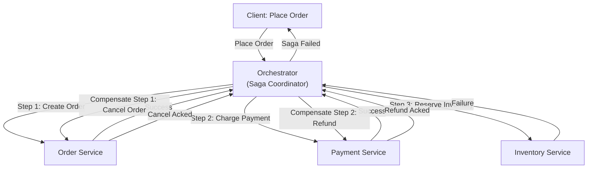

# Saga Pattern

A distributed transaction model that breaks a long-lived transaction into smaller, independent local transactions. When a step fails, compensating transactions undo previous steps. The modern alternative to 2PC.

---

## TL;DR

- **Saga**: Long transaction → chain of local transactions + compensating transactions
- **Two styles**: 
  - **Choreography**: Services trigger each other via events; distributed, loosely coupled
  - **Orchestration**: Coordinator service orchestrates the flow; centralized, easier to debug
- **Compensating transactions**: Custom logic to undo a committed transaction (refund payment, release reservation)
- **Consistency model**: Eventual consistency, not ACID. Intermediate states are visible to other transactions.
- **Use for**: Multi-service workflows, long-running transactions, systems that tolerate temporary inconsistency
- **Trade-off**: Complexity (handling failures, idempotency, compensations) vs. availability (no blocking, no single point of failure like 2PC coordinator)

---

## Core Concepts

### Saga as a Sequence

A saga is a sequence of local transactions T1, T2, ..., Tn, where:
- Each Ti is atomic within a single service
- If Ti fails, compensating transactions C(Ti-1), C(Ti-2), ..., C(T1) are executed in reverse
- No global lock or blocking

```
Happy path:
  T1 (order service) → T2 (payment service) → T3 (inventory) → T4 (notification) → SUCCESS

Failure scenario (T3 fails):
  T1 → T2 → T3 FAILS → C(T2) → C(T1) → ABORT
  
  Example:
  - T1: Create order (reserved order ID)
  - T2: Charge payment card
  - T3: Reserve inventory (FAILS — out of stock)
  - C(T2): Refund payment
  - C(T1): Delete order
```

### Compensating Transactions

A compensating transaction **semantically** undoes a previous transaction, but may not be a literal inverse:

```
Original: Debit account $100
Compensation: Credit account $100 (simple inverse)

Original: Book airline seat
Compensation: Cancel booking, send cancellation email, refund (more complex)

Original: Increment counter
Compensation: Decrement counter (trivial)

Note: Some operations are non-compensable (sending an email can't be unsent, only a follow-up apology sent)
```

---

## Style 1: Choreography

Each service listens to events and triggers the next service. No central coordinator.

### Mechanics



### Event Flow Example

```
1. Client submits order

2. Order Service receives "Create Order" request
   - Creates order record (status: PENDING)
   - Emits "OrderCreated" event
   - Returns to client

3. Payment Service listens to "OrderCreated"
   - Charges credit card
   - Emits "PaymentSucceeded" event
   - On failure: Emits "PaymentFailed" event

4. Inventory Service listens to "PaymentSucceeded"
   - Reserves stock
   - Emits "StockReserved" event
   - On failure: Emits "StockNotAvailable" event

5. Notification Service listens to "StockReserved"
   - Sends email confirmation
   - Emits "ConfirmationSent" event

6. Order Service listens to "ConfirmationSent"
   - Updates order status to CONFIRMED
   - Saga complete

Failure scenario (Stock not available):
  - Inventory Service emits "StockNotAvailable" event
  - Payment Service listens, refunds the charge
  - Order Service listens to "PaymentRefunded", cancels order
  - Saga rolls back
```

### Advantages

- **Decoupling**: Services don't know about each other, only events
- **Loose coupling**: Easy to add/remove services from the flow
- **Horizontal scalability**: No coordinator bottleneck
- **Autonomy**: Each service owns its local transaction and compensation logic

### Disadvantages

- **Difficult to debug**: No central place to see the flow; scattered across multiple services
- **Circular dependencies**: If Order Service also listens to "PaymentFailed" and Inventory listens to "OrderCancelled", complex event graphs emerge
- **Testing nightmare**: Hard to simulate all failure scenarios across multiple services
- **Event ordering issues**: Out-of-order events can break the saga (e.g., compensation event arrives before success event)

---

## Style 2: Orchestration

A central Orchestrator service directs the flow. Participants execute steps when told by the orchestrator.

### Mechanics



### State Machine in Orchestrator

```
State: PENDING
  → Execute T1 (Order Service)
  → On success: STEP_1_DONE
  → On failure: COMPENSATING

State: STEP_1_DONE
  → Execute T2 (Payment Service)
  → On success: STEP_2_DONE
  → On failure: COMPENSATING

State: STEP_2_DONE
  → Execute T3 (Inventory Service)
  → On success: COMPLETED
  → On failure: COMPENSATING

State: COMPENSATING
  → Execute C(T2) (Refund)
  → Execute C(T1) (Cancel)
  → ABORTED
```

### Advantages

- **Visibility**: Central place to see the entire workflow
- **Easier debugging**: Orchestrator logs show exactly which steps succeeded/failed
- **Failure handling**: Simple to decide what to do next (retry, compensate, alert)
- **Testable**: Mock the orchestrator's participants; simulate failure scenarios

### Disadvantages

- **Centralized dependency**: Orchestrator is a single point of failure (must be replicated/resilient)
- **Orchestrator must be stateful**: Need to store saga state (in DB or distributed state store)
- **Tight coupling**: Orchestrator knows all participants and their contracts
- **Scaling**: Orchestrator can become bottleneck if handling thousands of concurrent sagas

---

## Idempotency & Deduplication

### The Problem

Network delays and retries can cause duplicate messages:

```
Payment Service charges $100, returns success.
Orchestrator never receives the ACK, retries.
Payment Service charges $100 again (duplicate charge).
```

### Solution: Idempotent Operations

Each operation must be idempotent: running it twice = running it once.

```
Charge payment:
  If idempotency_key already processed:
    Return cached result (don't charge again)
  Else:
    Process payment
    Store (idempotency_key, result) in DB
    Return result

Retried operation:
  Same idempotency_key → lookup in DB → return cached result
  No duplicate charge
```

### Saga ID + Step ID as Idempotency Key

```
Idempotency key = "saga_12345_step_2"
If Payment Service sees this key twice, it skips the charge on retry.
```

---

## Handling Failure Cases

### Non-Idempotent Operations

Some operations cannot be made idempotent (e.g., sending email):

```
Solution 1: Accept potential duplicates
  - Customer gets 2 confirmation emails (unlikely, acceptable)
  - Monitor for duplicates, alert ops

Solution 2: External deduplication
  - Notification Service tracks sent emails by saga_id
  - Orchestrator retries safely; notification service dedupes

Solution 3: Re-design
  - Instead of "send email", use "queue notification"
  - Queue is idempotent (same message queued twice = same message once)
  - Worker processes queue and sends unique emails
```

### Handling Cascade Failures

```
Scenario:
  Order Service is down
  Orchestrator retries indefinitely
  Other sagas queue up, waiting

Solution:
  - Retry with exponential backoff
  - Max retries (e.g., 3 attempts), then MANUAL_INTERVENTION state
  - Alert operations team
  - Don't cascade compensation until manual confirmation
```

### Orphaned Sagas

```
Orchestrator crashes mid-saga (e.g., after T2 succeeds, before T3).
Compensation was never started.

Recovery:
  - Orchestrator persists state to DB before each step
  - On restart, replay from last checkpoint
  - Detect incomplete sagas (STEP_2_DONE after 1 hour) → escalate
```

---

## Choreography vs. Orchestration Comparison

| Aspect | Choreography | Orchestration |
|--------|--------------|---------------|
| **Coupling** | Loose (event-based) | Tight (orchestrator knows all) |
| **Visibility** | Distributed, hard to debug | Centralized, easy to debug |
| **Failure handling** | Complex (circular event logic) | Simple (orchestrator decides) |
| **Scalability** | High (no coordinator) | Limited (orchestrator is bottleneck) |
| **Testing** | Hard (distributed) | Easier (mock participants) |
| **Tooling** | Event streaming (Kafka) | Orchestration engine (Cadence, Temporal) |

**Rule of thumb**: Use choreography for simple, independent flows. Use orchestration for complex, ordered workflows with strict failure handling.

---

## Real-World Examples

### E-Commerce Order (Orchestration Preferred)

```
Order → Payment → Inventory → Notification
Complex flow, strict ordering, many failure points.
Use orchestrator to coordinate all steps.
```

### User Profile Updates (Choreography Possible)

```
User updates profile → Search index updated → Cache invalidated → Notification sent
Simple, loosely ordered steps. Can use events.
```

---

## Related Fundamentals

- **[Two-Phase Commit](two-phase-commit.md)**: Alternative (blocking) approach; 2PC vs. Saga trade-offs
- **[Distributed ACID](distributed-acid.md)**: ACID properties and eventual consistency trade-offs
- **[Messaging & Streaming](../messaging-and-streaming/)**: Event sourcing, Kafka, event ordering
- **[Microservices Architecture](../microservices-architecture/)**: Saga pattern is core to microservices resilience

---

## Key Takeaways

1. **Sagas break long transactions into independent local transactions**.
2. **Compensating transactions undo previous steps** on failure (eventual consistency).
3. **Choreography**: Decoupled, loose event-driven flows (hard to debug).
4. **Orchestration**: Centralized, ordered workflows (easier to debug, orchestrator is bottleneck).
5. **Idempotency is critical**: Retries can cause duplicate operations; must handle deduplication.
6. **Sagas scale better than 2PC**: No blocking, no global coordinator. Trade atomicity for availability.

---

**Study Tips**

- Trace through both choreography and orchestration for the same order flow.
- Identify where each style excels (choreography for decoupling, orchestration for debugging).
- Design idempotency keys for a payment saga.
- Mentally simulate network failures (dropped messages, delayed responses) for both styles.

---

**Status**: ✅ Complete
