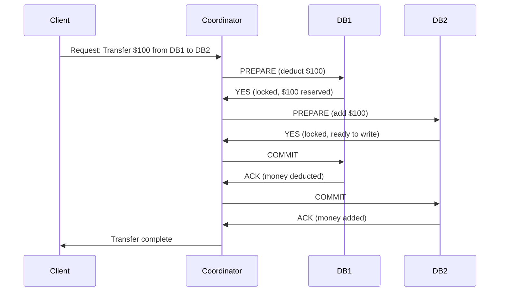

# Two-Phase Commit (2PC)

The classic protocol for coordinating distributed transactions across multiple databases or services. 2PC ensures ACID properties in a distributed system, but at a cost.

---

## TL;DR

- **2PC**: Coordinator sends PREPARE to all participants, collects votes, then sends COMMIT (or ROLLBACK) to all
- **Two phases**: Prepare (vote) and Commit (execute)
- **Blocking protocol**: Participants lock resources during prepare phase, waiting for commit decision
- **Failure modes**: Coordinator crash during commit leaves system in limbo; participant timeout or network partition can cause abort
- **Practical limits**: Not suitable for systems requiring high availability and low latency at scale (use Sagas instead)
- **Real-world usage**: Legacy enterprise systems, financial transactions within controlled networks

---

## Mechanics of 2PC

### Phase 1: Prepare (Voting Phase)

1. **Coordinator sends PREPARE request** to all participants (e.g., multiple DB instances, microservices)
2. **Each participant**:
   - Executes the transaction up to the COMMIT point (read, write, acquire locks)
   - Writes undo/redo logs to durable storage
   - **Replies YES** if it can commit (resource locks held)
   - **Replies NO** if it cannot (validation fails, deadlock detected, etc.)
3. **Coordinator collects all votes**:
   - **If all YES**: Proceed to Phase 2 with COMMIT
   - **If any NO**: Proceed to Phase 2 with ROLLBACK

### Phase 2: Commit (Action Phase)

1. **Coordinator sends COMMIT/ROLLBACK** decision to all participants
2. **Each participant**:
   - On COMMIT: Releases locks, makes changes permanent, acknowledges
   - On ROLLBACK: Uses undo logs to revert, releases locks, acknowledges
3. **Coordinator** ensures all participants acknowledge before completing

### Sequence Diagram



---

## Advantages

- **Atomicity guarantee**: Transaction is all-or-nothing across all systems. No partial commits.
- **Consistency**: ACID properties maintained in a distributed setting.
- **Simplicity of semantics**: Easy to reason about — commit succeeds or fails as a unit.
- **Proven in enterprise**: Used in banking, financial systems for decades.

---

## Disadvantages & Failure Modes

### Blocking

**The core problem**: Resources are locked during both phases.

```
Timeline:
T1: Prepare sent (participants lock resources)
T1-T2: Participants wait for coordinator decision (locks held, blocking other transactions)
T3: Commit decision received and executed

If T2 - T1 = 1 second, and thousands of concurrent transactions need these resources,
throughput collapses due to lock contention.
```

### Coordinator Failure During Commit

**Scenario**: Coordinator crashes after sending COMMIT to Participant A but before Participant B.

- Participant A has committed
- Participant B doesn't know if it should commit or roll back
- System is **in limbo** — inconsistent state
- Recovery requires:
  - Replicated/recoverable coordinator state (write-ahead logs)
  - Timeout logic (participants eventually decide: commit or abort)
  - Manual intervention in worst case

### Network Partition

If coordinator is partitioned from some participants:

- Coordinator may decide to ABORT (conservative approach)
- But participants that received COMMIT before partition may have already applied changes
- **Consensus is broken**: System is split-brain

### Timeout & Deadlock

- Participants hold locks during prepare phase. If a participant crashes during prepare, locks persist until detection timeout (30+ seconds in some systems)
- All other transactions waiting for those resources are blocked
- **Cascade failures**: One slow/crashed node blocks the entire system

### Performance Impact

- **Latency**: 2 round trips + lock time = high latency (100+ ms in WANs)
- **Throughput**: Lock contention reduces concurrent transactions
- **Availability**: Blocking reduces fault tolerance; a single slow participant slows all transactions

---

## Failure Recovery Mechanisms

### Write-Ahead Logging (WAL)

Coordinator and participants log state before taking action:
- Before PREPARE: Log transaction details
- Before COMMIT: Log commit decision
- On crash recovery: Replay logs to reach consistent state

### Heuristic Commit/Abort

If recovery times exceed acceptable limits, some systems use **heuristic decisions**:
- Assume COMMIT (optimistic) — risky, can cause inconsistency
- Assume ABORT (pessimistic) — safe but wastes work
- Manual override flag for exceptional cases

### Timeout Logic

```
Pseudocode:
  if (no ACK from participant for 30 seconds during commit phase):
    if (decision = COMMIT):
      Assume participant crashed but will replay from logs
      Continue with other participants
      Coordinator can later verify participant committed
    if (decision = ABORT):
      Safe to proceed; abort propagates eventually
```

---

## When to Use 2PC

**Suitable for**:
- Small number of participants (2–4 databases, not 100 microservices)
- Transactions with tight latency tolerance (sub-100ms)
- Closed networks (low network latency, low partition risk)
- Systems where atomicity is non-negotiable (financial txns, inventory deductions)

**Unsuitable for**:
- Systems with many microservices (cascading timeouts)
- Geo-distributed systems (high latency magnifies blocking)
- Systems requiring high availability (blocking reduces fault tolerance)
- Systems expecting frequent failures (coordinator recovery adds complexity)

---

## Real-World Examples

### Banking (Suitable)

```
Transfer $100 across two internal bank databases:
- DB1 (accounts): Deduct from checking
- DB2 (audit log): Record transaction

Both databases are in same data center (low latency).
Atomicity is critical — never deduct without recording.
2PC is a good fit.
```

### E-Commerce at Scale (Unsuitable)

```
Order transaction touches:
- Order service (create order)
- Payment service (charge card)
- Inventory service (reserve stock)
- Notification service (send confirmation)

If any of 4 services is slow/down:
- Locks held on order ID
- Other customers' orders blocked
- System cascades into slowness/unavailability
Better approach: Saga pattern with compensating transactions
```

---

## Comparison with Alternatives

| Aspect | 2PC | Saga (Choreography) | Saga (Orchestration) |
|--------|-----|-------------------|----------------------|
| **Atomicity** | Strong | Weak (eventual) | Weak (eventual) |
| **Latency** | High (blocking) | Low (async) | Medium |
| **Complexity** | Moderate | Low | High |
| **Scalability** | Poor (blocking) | Good | Good |
| **Failure handling** | Automatic rollback | Manual compensations | Orchestrator-coordinated |

---

## Related Fundamentals

- **[Saga Pattern](saga-pattern.md)**: Practical alternative to 2PC for distributed transactions
- **[Distributed ACID](distributed-acid.md)**: ACID properties in distributed systems
- **[Consensus & Coordination](../consensus-and-coordination/)**: Raft, Paxos for distributed agreement
- **[Databases - Transactions & Isolation](../databases/transactions-and-isolation-levels.md)**: Single-system ACID foundation

---

## Key Takeaways

1. **2PC is the textbook solution** for distributed ACID but has severe practical limitations.
2. **Blocking is the core problem**: Resources locked during prepare/commit phases, reducing throughput and availability.
3. **Failure recovery is complex**: Coordinator crashes leave systems in limbo; heuristic decisions required.
4. **Use sparingly**: Limit to 2–3 participants in low-latency networks. Scale to microservices requires Sagas.
5. **Modern systems prefer eventual consistency**: Accept temporary inconsistency, use compensating transactions (Sagas) to eventually reconcile.

---

**Study Tips**

- Trace through the prepare/commit phases step-by-step for a concrete scenario (e.g., money transfer).
- Draw a timeline showing where blocking occurs.
- Mentally crash the coordinator at each step — understand recovery for each case.
- Compare latency: 2PC (100ms) vs. Saga (10ms per step, async) for 3 participants.

---

**Status**: ✅ Complete
